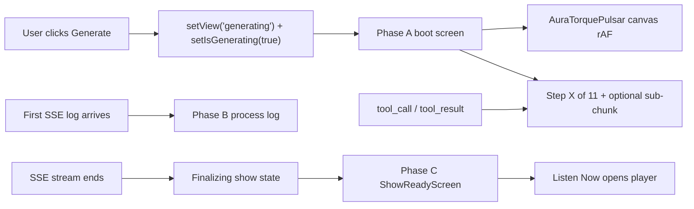

# Aura Torque Pulsar Loading Spinner + Creation Progress

## Problem

When the user clicks **Generate**, React switches to `view === 'generating'` but immediately mounts a heavy UI: `AnimatePresence`, a full process-log terminal, and markdown/JSON rendering for streaming tool events. That first paint blocks the main thread, so the **previous home frame (textarea + form controls) stays visible and frozen**.

Users also have no clear sense of **where they are in the 10-step pipeline** — only a free-text `currentStage` string that changes opportunistically from tool-call heuristics.

**"Show Ready" feels frozen / unlaunchable** — root causes in [`src/App.tsx`](src/App.tsx):

| Issue | Where | Effect |
|-------|-------|--------|
| CTA buried in scroll area | ~1580–1601 | "Listen Now" renders at the **bottom of the log panel**; with hundreds of log lines it is off-screen |
| No scroll on complete | ~1428–1432 | Auto-scroll `useEffect` depends on `generationLogs` only — **not** `generationComplete`, so completion buttons may never scroll into view |
| Loading chrome persists | ~1441–1443 | Header Bot icon still `animate-pulse` + spinning ring when `generationComplete` is true — looks stuck |
| 2s dead zone | ~1326–1364 | After SSE ends, `isGenerating` stays true for 2s while UI still shows "Working" before `generationComplete` flips |
| No show preview | completion block | Header says "Show Ready" but user cannot see title, cover, or duration — no obvious "this is your show" moment |

Current loading indicators are inconsistent small `Loader2` / `Bot` icons in three places inside [`src/App.tsx`](src/App.tsx):

| Location | Lines (approx) | Current UI |
|----------|----------------|------------|
| Generation screen | 1441-1444, 1557-1571 | Bot + Loader2 + process log |
| Shared show fetch | 2237-2250 | Loader2 in circle |
| Share upload modal | 2699-2720 | Loader2 + progress % |

Inspiration file [`spinner_25_aura_torque_pulsar.js`](spinner_25_aura_torque_pulsar.js): 3 counter-rotating neon arc rings with glow + a pulsing central aperture.



---

## Solution

### 1. New canvas component (no p5 dependency)

Create [`src/components/AuraTorquePulsarSpinner.tsx`](src/components/AuraTorquePulsarSpinner.tsx):

- Props: `size?: number` (default `160`), `className?: string`
- `useRef` for `<canvas>`, `useEffect` with `requestAnimationFrame` loop, cleanup on unmount
- Port the p5 `draw()` logic to Canvas 2D API (3 neon arc rings + central pulsing aperture)
- `devicePixelRatio` scaling for sharp rendering on retina displays
- `pointer-events-none` on canvas

### 2. Shared loading shell component

Create [`src/components/LoadingScreen.tsx`](src/components/LoadingScreen.tsx):

```tsx
interface LoadingScreenProps {
  title: string;
  subtitle?: string;
  children?: React.ReactNode; // progress bar, Stop button, elapsed timer
  fullScreen?: boolean;       // default true
}
```

Layout: `RainbowBackground` + centered `AuraTorquePulsarSpinner` + title/subtitle + optional slot.

### 3. Creation progress — two levels

Create [`src/generationProgress.ts`](src/generationProgress.ts) to centralize progress logic (keeps `App.tsx` slimmer).

#### Level 1 — Pipeline step (always shown)

Canonical 10 steps from [`agent/AGENTS.md`](agent/AGENTS.md):

| Step | Label | Detect via `tool_call` command substring |
|------|-------|------------------------------------------|
| 0 | Initializing | default until first match |
| 1 | Researching topic | `fetch_hn.py`, `fetch_github.py`, `fetch_url.py` |
| 2 | Writing script | `generate_script.py` |
| 3 | Reviewing script | `script_review.py` |
| 4 | Generating speech | `generate_tts.py` |
| 5 | Generating music | `generate_music.py` |
| 6 | Generating sound effects | `generate_sfx.py` |
| 7 | Mixing audio | `mix_audio.py` |
| 8 | Quality check | `quality_check.py` |
| 9 | Generating metadata | `generate_metadata.py` |
| 10 | Generating cover image | `generate_image.py` |
| 11 | Packaging show | info message contains `Downloading` or `Processing final audio` |

Export:

```typescript
export interface GenerationProgress {
  stepIndex: number;      // 0–11
  stepTotal: number;        // 11 (packaging is final)
  stepLabel: string;
  subCurrent?: number;
  subTotal?: number;
  subLabel?: string;       // e.g. "Processing turn 3 of 12"
}

export function progressFromToolCall(name: string, args: unknown): GenerationProgress | null;
export function progressFromToolResult(name: string, result: string, current: GenerationProgress): GenerationProgress;
export function progressFromInfoMessage(message: string, current: GenerationProgress): GenerationProgress;
```

Refactor existing `setCurrentStage(...)` heuristics in [`src/App.tsx`](src/App.tsx) (~1283–1300) into `progressFromToolCall`. Keep `read_file` path hints as "Preparing …" sub-label without advancing step index.

#### Level 2 — Sub-chunk progress (when parseable)

Parse `bash` / `code_execution_call` **tool_result** stdout (already available in SSE stream) for patterns emitted by [`agent/skills/tts-generation/scripts/generate_tts.py`](agent/skills/tts-generation/scripts/generate_tts.py):

- Prep line: `[3/12] Marcus (...)` → regex `/\[(\d+)\/(\d+)\]/` → `subCurrent: 3, subTotal: 12, subLabel: "Processing turn 3 of 12"`
- Summary line: `Segments: 8/12` → regex `/Segments:\s*(\d+)\/(\d+)/`

Only apply sub-chunk parsing when `stepIndex === 4` (Generating speech). Clear `subCurrent`/`subTotal` when pipeline step advances.

**Note:** SSE transport chunks are not user-meaningful — progress is derived from **pipeline steps** and **script stdout**, not raw stream byte chunks.

#### Progress UI component

Create [`src/components/GenerationProgressBar.tsx`](src/components/GenerationProgressBar.tsx):

- Overall bar: `stepIndex / stepTotal` (cap at ~95% until `generationComplete`, then 100%)
- Primary label: `Step 4 of 11 — Generating speech`
- Secondary label (when sub-chunk known): `Processing turn 3 of 12`
- Optional inner sub-bar: `subCurrent / subTotal` within the current step segment (visual only — don't try to compute global % from sub-steps unless both are known)

Show on:
- **Boot phase** loading screen (below spinner, above elapsed timer)
- **Active phase** generating header (compact variant above process log)

### 4. Generation flow — three-phase UI

Edit [`src/App.tsx`](src/App.tsx) `view === 'generating'` block (~lines 1434–1648):

**Phase A — Boot** (`isGenerating && generationLogs.length === 0 && !generationComplete`):

- `LoadingScreen` with spinner + `currentStage` + `GenerationProgressBar` + elapsed timer + **Stop Agent**
- Do **not** mount process-log terminal

**Phase B — Active** (`generationLogs.length > 0 && !generationComplete`):

- Process-log layout; replace Bot/Loader2 header with smaller spinner + `GenerationProgressBar` (compact)
- Update `generationProgress` state on each `tool_call`, `tool_result`, and relevant `info` event in the SSE handler (~1281–1312)
- Footer shows "Working" + Stop Agent while `isGenerating`

**Phase C — Show ready** (`generationComplete && selectedShow`):

Replace the entire generating layout (do **not** keep the log terminal as the dominant view). Create [`src/components/ShowReadyScreen.tsx`](src/components/ShowReadyScreen.tsx):

```
┌─────────────────────────────────────┐
│  ✓  Show Ready                      │
│  [cover image]                      │
│  "{selectedShow.title}"             │
│  {duration} · saved to your library │
│                                     │
│  [  ▶  Listen Now  ]  (primary)     │
│  [ View Process Log ]  (secondary)    │
│  [ Back to Home ]                   │
└─────────────────────────────────────┘
```

- **No spinner** — static green checkmark or subtle success glow (spinner stopped)
- **Cover + title** from `selectedShow` (already set at line 1339 before `generationComplete`)
- **Listen Now** — large, above-the-fold, `data-testid="listen-now"`; calls `setView('player')` + `setGenerationComplete(false)`
- **View Process Log** — toggles `showGenerationLog` state to reveal the log panel as a collapsible drawer/modal below the card (logs preserved, not the default view)
- **Back to Home** — `setView('home')` + reset completion state

Remove the in-scroll completion block (~1580–1601) — it is the source of the buried-CTA bug.

**Finalizing state** (fix 2s dead zone, ~1326–1364):

- When SSE stream ends (`reader.read()` returns `done`), immediately set `isFinalizing: true` and stage label **"Finalizing your show…"** (keep spinner, progress bar at ~95%)
- Replace blind `await 2000` with: save to IndexedDB + set `selectedShow` (can run during finalizing UI)
- Remove or shorten delay to ≤500ms (animation only); then `setGenerationComplete(true)` + `setIsFinalizing(false)` + `setIsGenerating(false)`
- User never sees "Working" after the agent has finished

**Belt-and-suspenders on home view**: if `isGenerating` while `view === 'home'`, hide form contents and show spinner only.

### 5. Shared-show loading

Replace `sharedShowLoading` block (~2237–2250) with `LoadingScreen` (no step progress — not a generation flow).

### 6. Share upload modal loading

Replace `sharingInProgress` block (~2699–2720) with smaller `AuraTorquePulsarSpinner` + existing `uploadStatus` + progress bar. Keep numeric `uploadProgress` label below spinner (already meaningful: 10%–98% mapped from xhr upload events).

---

## Files changed

| File | Action |
|------|--------|
| [`src/components/AuraTorquePulsarSpinner.tsx`](src/components/AuraTorquePulsarSpinner.tsx) | **Create** — canvas rAF spinner |
| [`src/components/LoadingScreen.tsx`](src/components/LoadingScreen.tsx) | **Create** — shared full-screen loading layout |
| [`src/components/GenerationProgressBar.tsx`](src/components/GenerationProgressBar.tsx) | **Create** — step + sub-chunk progress UI |
| [`src/components/ShowReadyScreen.tsx`](src/components/ShowReadyScreen.tsx) | **Create** — completion screen with cover preview + launch CTA |
| [`src/generationProgress.ts`](src/generationProgress.ts) | **Create** — step mapping + stdout parsing |
| [`src/App.tsx`](src/App.tsx) | **Edit** — three-phase generating UI, finalizing state, progress state, swap all loading states |

No server changes required for MVP — progress is inferred client-side from existing SSE events.

### Future enhancement (out of scope)

- Emit explicit `{ type: "progress", step, subCurrent, subTotal }` SSE events from [`server.ts`](server.ts) if stdout parsing proves unreliable
- Add `[i/N]` print lines to other long-running scripts (music, mixing) for richer sub-chunk detail

---

## Verification

```bash
npm run lint
npm run build
npm run test:e2e
```

Manual checks:

1. Click **Generate** — home form disappears; spinner + `Step 1 of 11` (or Initializing) show immediately
2. During TTS — secondary label shows `Processing turn X of Y` when bash output includes `[X/Y]`
3. Step label advances through script → TTS → mix → metadata → cover → packaging
4. Shared show URL and share upload modal use same spinner aesthetic
5. Stop Agent works during boot phase
6. On completion — dedicated **Show Ready** screen with cover + title visible; **Listen Now** is immediately visible without scrolling
7. After SSE ends — UI shows "Finalizing your show…" (not "Working") until launch screen appears

## Edge cases

- **Music/SFX disabled**: steps 5–6 may complete in <1s — step index still advances when matching commands run or are skipped; bar may jump (acceptable)
- **Research variable length**: no sub-chunks; step 1 label only
- **tool_result arrives before tool_call**: sub-chunk parsing uses current step from last known progress
- **Truncated tool_result** (>4000 chars): sub-chunk regex runs on truncated text — latest `[X/Y]` near end may be lost; step-level progress still works
- **Generation fails** (`generatedShow` null): skip Phase C; show error state with Go Back (existing branch, not buried in logs — move to same full-screen pattern as quota error)
- **User clicks View Process Log**: expand logs inline; Listen Now remains visible at top of completion card
