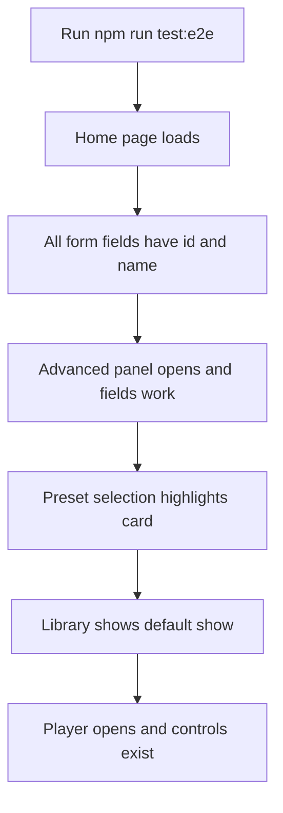

# Form Field Fix + Playwright Review Protocol

## Problem

Chrome DevTools reports: *"A form field element has neither an id nor a name attribute."* All **15 interactive form controls** in [`src/App.tsx`](src/App.tsx) lack both attributes, and their `<label>` elements lack `htmlFor` associations.

Affected controls:

| Location | Elements |
|----------|----------|
| Generate form | `textarea` (topic), `select` (duration, mood) |
| Advanced panel | `input` (host name, guest count), `textarea` (persona), `select` (voice, delivery, style, guest mode, music), 11 `checkbox` (features) |
| Player | `input[type=range]` (timeline, volume) |
| Share modal | `input` (read-only share URL) |

Labels exist visually but are not programmatically linked — bad for autofill, screen readers, and test selectors.

---

## Fix: Form field attributes

Edit [`src/App.tsx`](src/App.tsx) only. Add a small constant map at the top of the file (or inline) to keep IDs consistent:

```typescript
const FORM_IDS = {
  topic: 'show-topic',
  duration: 'show-duration',
  mood: 'show-mood',
  hostName: 'host-name',
  hostVoice: 'host-voice',
  hostPersona: 'host-persona',
  hostDelivery: 'host-delivery',
  showStyle: 'show-style',
  guestMode: 'guest-mode',
  guestCount: 'guest-count',
  musicMood: 'music-mood',
  playbackTimeline: 'playback-timeline',
  playbackVolume: 'playback-volume',
  shareUrl: 'share-url',
} as const;
```

For each control, add **both** `id` and `name` (same value is fine), plus:

- **`htmlFor`** on every adjacent `<label>` matching the field `id`
- **`autoComplete="off"`** on customization fields (host/guest/features) — not meaningful for autofill
- **`autoComplete="off"`** on topic textarea (user content, not PII to remember)
- **`aria-label`** on range inputs (timeline/volume) since they have no visible label element

Example pattern for Advanced panel host name:

```tsx
<label htmlFor={FORM_IDS.hostName} className="...">Host name</label>
<input
  id={FORM_IDS.hostName}
  name={FORM_IDS.hostName}
  type="text"
  autoComplete="off"
  ...
/>
```

Feature checkboxes: `id={`feature-${key}`}` / `name={`feature-${key}`}` with labels using `htmlFor`.

Generate form `<form>`: add `aria-label="Generate radio show"` for context.

No behavioral changes — React controlled state stays the same.

---

## Review protocol: Playwright smoke tests

Since you chose **automated tests only**, Playwright becomes the review protocol. Run before every handoff:

```bash
npm run lint && npm run build && npm run test:e2e
```

### Setup (new files)

| File | Purpose |
|------|---------|
| [`playwright.config.ts`](playwright.config.ts) | Base URL `http://localhost:3000`, reuse dev server |
| [`e2e/show-generator.spec.ts`](e2e/show-generator.spec.ts) | 4–5 focused smoke tests |
| [`package.json`](package.json) | Add `@playwright/test`, scripts `test:e2e` and `test:e2e:ui` |

`playwright.config.ts` will use `webServer` to run `npm run dev` automatically during tests (or `vite preview` after build for CI-style runs).

### Test cases (review checklist encoded as tests)



1. **Home page loads** — heading/generate form visible
2. **Form fields have id and name** — query every `#show-topic`, `#show-duration`, `#show-mood`; assert `name` attribute present (catches regression on the DevTools warning)
3. **Advanced panel toggles and fields are labeled** — click Advanced, assert `#host-name`, `#host-voice`, etc. exist; fill host name, verify value persists after collapse/reopen (localStorage)
4. **Preset selection works** — click "Tech Debate" preset card, assert selected styling; open Advanced, assert style-related state updated
5. **Library playback shell** — click first library show, assert player timeline `#playback-timeline` and volume `#playback-volume` exist with `name` attributes

Tests use **`getByRole` / `#id` selectors** — no fragile CSS classes. Generation API is **not** called in smoke tests (avoids Gemini quota/cost); mock only if needed later.

### Dev server note

[`server.ts`](server.ts) serves Vite on port 3000 via `npm run dev`. Playwright `webServer` config:

```typescript
webServer: { command: 'npm run dev', url: 'http://localhost:3000', reuseExistingServer: true }
```

---

## Verification after implementation

1. `npm run lint` — TypeScript passes
2. `npm run build` — production bundle succeeds
3. `npm run test:e2e` — all smoke tests green
4. Manual 30-second check in Chrome DevTools **Issues** panel — form-field warnings gone on home + Advanced open

---

## Out of scope (not part of this task)

- Separate `REVIEW.md` document (per your choice)
- Full end-to-end generation test against live Gemini API
- Phase 4 polish from customization plan (voice previews, guest roster cards, segment toggles UI) — separate follow-up

---

## Files to change

| File | Change |
|------|--------|
| [`src/App.tsx`](src/App.tsx) | Add `id`, `name`, `htmlFor`, `aria-label` to all 15 form controls |
| [`playwright.config.ts`](playwright.config.ts) | **Create** — Playwright config with webServer |
| [`e2e/show-generator.spec.ts`](e2e/show-generator.spec.ts) | **Create** — 5 smoke tests |
| [`package.json`](package.json) | Add Playwright devDep + `test:e2e` script |
