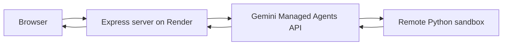

# Free Production Deployment Plan

## What you are deploying

This is **not** a static React site. It is a single **Node.js server** ([`server.ts`](server.ts)) that:

- Serves the React UI (built to `dist/`)
- Runs long-lived **SSE** streams during show generation (often 5–15+ minutes)
- Reads the [`agent/`](agent/) folder at request time and sends it to **Gemini Managed Agents** (Python runs remotely on Google’s side — you do not host Python)



**Do not use** Vercel/Netlify serverless for this app — their request timeouts are too short for multi-minute generation streams.

---

## Recommended: Render free web service

**Why this is the best fit for “simple + free + personal”:**

| Requirement | Render free tier |
|---|---|
| Long-running Node + SSE | Supported (timeouts disabled in server) |
| Writable disk (`output/`, quota cache) | Ephemeral but fine for personal use |
| Git push deploy | Yes — no Docker required |
| Cost | $0 on Hobby plan (750 instance-hours/month, no credit card) |
| Custom HTTPS URL | Yes (`*.onrender.com`) |

**Tradeoffs you should expect:**

- Service **spins down after 15 min idle** → first visit after idle takes ~1 min to wake up
- **Ephemeral filesystem** → quota cache resets on restart (irrelevant for personal use)
- **Public URL** → anyone with the link could use your Gemini quota unless you add protection later
- [`/api/download-zip`](server.ts) uses the shell `zip` command — may fail on Render unless `zip` is installed in the build step (MP3 playback/download in-browser still works)

---

## What actually costs money

Hosting on Render free tier: **$0**.

The real cost is **Gemini API usage** (TTS, music, image gen, agent compute). Budget for that separately at [Google AI Studio](https://aistudio.google.com/apikey). Firebase and GCS are **optional** — skip them for personal/friends use.

---

## Step-by-step deployment

### 1. One required code change: respect `PORT`

Render injects a dynamic port. Your server hardcodes `3000`:

```151:151:server.ts
  const PORT = 3000;
```

Change to:

```typescript
const PORT = Number(process.env.PORT) || 3000;
```

Without this, the deploy will fail or not receive traffic.

### 2. Push code to GitHub

Render deploys from Git. If the repo is not on GitHub yet, push it there first.

### 3. Create a Render web service

In [Render Dashboard](https://dashboard.render.com) → **New → Web Service** → connect your repo.

| Setting | Value |
|---|---|
| **Runtime** | Node |
| **Build command** | `npm install && npm run build` |
| **Start command** | `npm run start` |
| **Instance type** | **Free** |
| **Health check path** | `/api/health` |

### 4. Set environment variables

Minimum for personal use:

| Variable | Value |
|---|---|
| `GEMINI_API_KEY` | Your key from AI Studio |
| `NODE_ENV` | `production` (serves built `dist/` assets) |
| `DAILY_QUOTA_LIMIT` | `50` (or higher — default is 3, and without Firebase all anonymous users share one bucket) |

**Skip for now:** `GCS_BUCKET_NAME`, Firebase credentials, `firebase-applet-config.json` real values. Google sign-in will not work, but generation works fine for personal use.

### 5. Deploy and smoke-test

After the first deploy succeeds:

1. Open your `*.onrender.com` URL
2. Generate a short show (e.g. 2 min duration) to validate the full SSE pipeline
3. Confirm audio playback works

Your existing pre-deploy checklist still applies locally before pushing:

```bash
npm run lint && npm run build && npm run test:e2e
```

(E2E tests do not hit the live Gemini API — safe to run.)

---

## Optional improvements (not required for v1)

- **Keep the URL private** — treat the Render URL like a secret; only share with friends
- **Custom domain** — Render Hobby includes 2 free custom domains
- **Fix zip downloads on Linux** — add `apt-get install -y zip` to build if you use “Download ZIP” in production (or replace shell `zip` with the existing `archiver` npm dependency later)
- **Upgrade to Render Starter ($7/mo)** later if you want always-on (no cold starts) for demos

---

## Alternatives (why not these)

| Option | Verdict |
|---|---|
| **Google AI Studio republish** | Simplest if you never left AI Studio, but you are already developing locally in this repo — Render is more direct |
| **Vercel / Netlify Functions** | Wrong fit — serverless timeouts kill multi-minute SSE generation |
| **Oracle Cloud / Fly.io free VPS** | Truly free and always-on, but much more setup (VM, nginx, systemd) for marginal gain over Render |
| **Firebase Hosting alone** | Static only — cannot run your Express server |

---

## Summary

**Simplest free path:** Render free web service + `GEMINI_API_KEY` + one-line `PORT` fix + `DAILY_QUOTA_LIMIT` bumped for personal use. No Firebase, no GCS, no Docker. Total hosting cost: **$0**.
