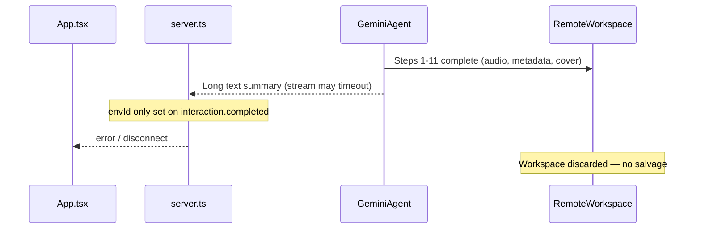

# Generation Salvage & Resume Plan

## Problem

Today, all pipeline artifacts live in the **ephemeral Gemini remote workspace** and are only delivered on success via environment tar download in [`server.ts`](server.ts) (lines 806–858). If the SSE stream dies before `interaction.completed` — common at step 11–12 when the agent writes a long final summary (see [`runtime_logs/agent-logs-2026-06-28T16-05-40.896Z.txt`](runtime_logs/agent-logs-2026-06-28T16-05-40.896Z.txt)) — the user gets **zero output** despite expensive LLM work already done.



The client already supports reusing environments via [`server/lib/agentClient.ts`](server/lib/agentClient.ts) (`environmentId`, `previousInteractionId`) but nothing persists or uses these today.

---

## Strategy (three layers)

### Layer 1 — Salvage whatever exists (highest impact, fixes your phase-11 failures)

Extract tar download + show assembly into a shared module and run it on **any** path where we can obtain an `envId`, not only the happy path.

**New file:** [`server/lib/workspaceSalvage.ts`](server/lib/workspaceSalvage.ts)

| Function | Responsibility |
|----------|----------------|
| `downloadWorkspace(envId)` | Reuse existing `extractTarInMemory` logic from `server.ts` |
| `detectCompletedStep(files)` | Map workspace files → pipeline step (mirror matchers in [`src/generationProgress.ts`](src/generationProgress.ts)) |
| `assembleShowFromWorkspace(files, showConfig)` | Build `RawRadioShow` with priority: `show_notes.json` → fallback from `timeline_manifest.json` + `script.md` (pattern already exists in [`generate_metadata.py`](agent/skills/metadata-generation/scripts/generate_metadata.py) `make_fallback_metadata`) → minimal stub if only `ai_radio.mp3` exists |
| `salvageCompleteness(step, hasAudio, hasNotes)` | Return `'full' \| 'playable' \| 'partial'` for UI labeling |

**Acceptance tiers:**
- **Full**: `show_notes.json` + `ai_radio.mp3` (current success bar)
- **Playable**: `ai_radio.mp3` + reconstructed metadata (title from config topic, transcript from manifest/script)
- **Partial**: script/research only (show in UI as draft, no playback)

Emit new SSE events from the generation handler:
- `checkpoint` — `{ generationId, interactionId?, environmentId?, lastCompletedStep, status }`
- `salvage_data` — same shape as `show_data` plus `{ completeness, lastCompletedStep, canResume }`

If `show_notes.json` is missing but `ai_radio.mp3` exists, **do not error** — salvage as `playable` instead of the current hard failure at line 847–848.

---

### Layer 2 — Recover `envId` when the stream dies early

**Extend** [`server/lib/agentClient.ts`](server/lib/agentClient.ts):
- Parse `interaction.id` from `interaction.completed` (already have `interaction` object)
- Add `getInteraction(interactionId)` → `GET ${API_BASE_URL}/interactions/${id}` for polling when stream ends without `envId`
- Handle both `interaction.completed` and `interaction.complete` event types (API docs vary; log unhandled types today)

**Track run state** during streaming in `server.ts`:
```ts
interface GenerationRunState {
  generationId: string;
  showConfig: ShowConfig;
  interactionId?: string;
  environmentId?: string;
  lastCompletedStep: number; // from tool_call matchers
  status: 'running' | 'failed' | 'salvaged' | 'completed';
}
```

Update `lastCompletedStep` server-side by importing/reusing matchers from `generationProgress.ts` (move shared matchers to `src/generationProgress.ts` or a small `server/lib/pipelineSteps.ts` to avoid duplication).

**On stream end (error, timeout, client disconnect):**
1. If `environmentId` known → salvage immediately
2. Else if `interactionId` known → poll `getInteraction` every 5s for up to 2 min; on `status: completed`, extract `environment_id` and salvage
3. Persist checkpoint to disk: `output/checkpoints/{generationId}.json` (24h TTL, excluded from the 1h `output/` subdir cleanup in `cleanUpOldGenerations`)

**New endpoints:**
| Route | Purpose |
|-------|---------|
| `GET /api/generation-checkpoint/:generationId` | Client fetches checkpoint after reconnect |
| `POST /api/salvage-show` | Body: `{ generationId }` — re-attempt tar download from saved `environmentId` |
| `POST /api/resume-show` | Body: `{ generationId }` — SSE stream, resumes agent from checkpoint |

Resume does **not** increment quota (per your preference); gate with `resumeGenerationId` flag instead of `incrementQuotaCount`.

---

### Layer 3 — Retry from last completed step

**New file:** [`server/lib/resumePrompt.ts`](server/lib/resumePrompt.ts)

`buildResumePrompt(config, lastCompletedStep)` returns a prompt like:

> The previous run failed after completing step N. **Do not redo completed steps.** Verify these files exist, then continue from step N+1 only: [list expected artifacts per step from `AGENTS.md`]. Follow AGENTS.md. Do not write a long final summary — stop after all files are produced.

Step → resume command mapping (from [`agent/AGENTS.md`](agent/AGENTS.md)):

| Last completed step | Resume from |
|-------------------|-------------|
| 10 (metadata) | `generate_image.py` only |
| 8 (mix) | `quality_check.py` → metadata → cover |
| 5 (TTS) | `generate_music.py` onward |
| … | corresponding tail of pipeline |

**Resume handler** (`POST /api/resume-show`):
1. Load checkpoint; validate `environmentId` + `showConfig`
2. `createInteraction({ prompt: buildResumePrompt(...), environmentId, previousInteractionId, stream: true })`
3. Reuse the same SSE + salvage logic as `/api/generate-show`

**Agent instruction tweak** in [`agent/AGENTS.md`](agent/AGENTS.md):
- After step 11, agent must **not** produce a long markdown recap (root cause of step-12 timeouts). One sentence max; files speak for themselves.

---

## Client UI changes ([`src/App.tsx`](src/App.tsx))

On generation end without `generatedShow`:

1. Handle `salvage_data` → save to IndexedDB with `isPartial: true` / `completeness` badge
2. Handle `checkpoint` → store in React state `failedCheckpoint`
3. Show failure panel with:
   - **"Use salvaged show"** (if `salvage_data` received) — selects show in library
   - **"Retry from step N"** → calls `POST /api/resume-show` with same `generationId`
   - **"Start over"** → normal `handleGenerate` (counts quota)

Add types in [`src/types.ts`](src/types.ts):
```ts
export interface GenerationCheckpoint {
  generationId: string;
  lastCompletedStep: number;
  canResume: boolean;
  completeness?: 'full' | 'playable' | 'partial';
}
```

Optional: persist checkpoint ref in `sessionStorage` so a tab refresh can still offer resume.

---

## Failure mode addressed (your recent runs)

Your log shows steps 1–11 completed (`show_notes.json`, `cover.png`, `ai_radio.mp3` all present) but the stream ended during a verbose `[text]` summary. With this plan:

1. **Poll interaction** after stream drop → obtain `envId`
2. **Salvage tar** → deliver `playable`/`full` show via `salvage_data`
3. If poll also fails, **checkpoint** still enables manual **Resume** within 7 days (Gemini env retention)

---

## Files to change

| File | Change |
|------|--------|
| [`server/lib/workspaceSalvage.ts`](server/lib/workspaceSalvage.ts) | **New** — download, detect step, assemble show |
| [`server/lib/resumePrompt.ts`](server/lib/resumePrompt.ts) | **New** — resume prompt builder |
| [`server/lib/agentClient.ts`](server/lib/agentClient.ts) | `getInteraction`, parse interaction id, dual event types |
| [`server.ts`](server.ts) | Run state tracking, salvage on failure, 3 new routes, refactor tar path |
| [`src/generationProgress.ts`](src/generationProgress.ts) | Export step matchers + artifact map for server reuse |
| [`src/types.ts`](src/types.ts) | Checkpoint + completeness types |
| [`src/App.tsx`](src/App.tsx) | Handle new SSE events, retry/salvage UI |
| [`agent/AGENTS.md`](agent/AGENTS.md) | Short final summary rule |

---

## Testing plan

1. **Simulated late failure**: mock stream ending after `generate_image.py` tool_result without `interaction.completed` → verify poll + salvage delivers audio
2. **Missing show_notes**: tar with only `ai_radio.mp3` + `timeline_manifest.json` → `playable` salvage
3. **Resume**: fail at step 10, resume → agent runs only steps 11–12
4. **Quota**: resume does not call `incrementQuotaCount`; fresh generate still does
5. **Checkpoint TTL**: file expires after 24h, resume returns 404 with clear message

---

## Out of scope (future)

- Mid-run incremental uploads from agent to server (heavy; env reuse is sufficient)
- Cross-device resume (would need user-scoped checkpoint storage in GCS/Supabase)
- Automatic retry without user action
