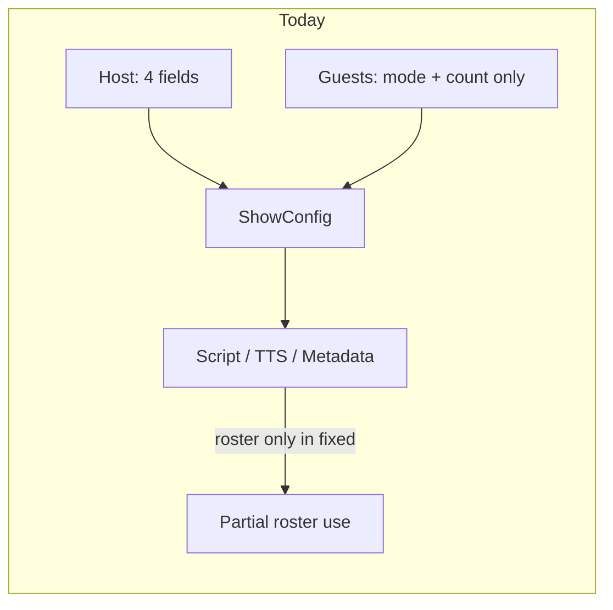
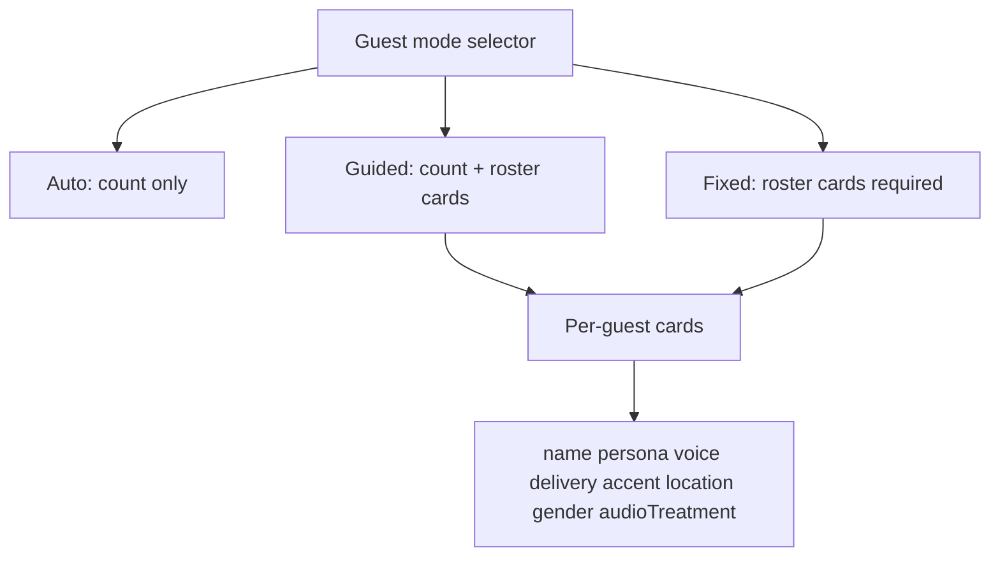
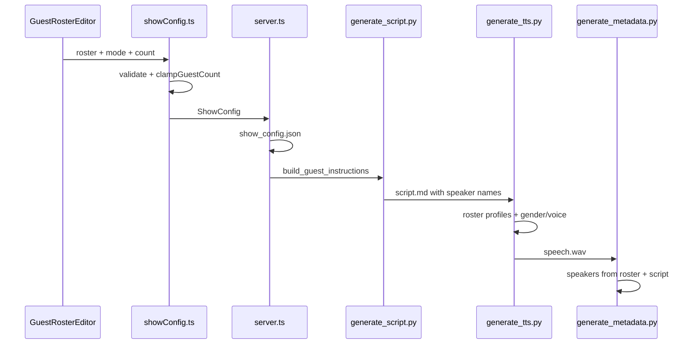

# Guest Parameter Parity Plan

## Problem

Host settings are fully editable in the Advanced panel ([`src/App.tsx`](src/App.tsx)): name, voice, persona, delivery. Guests only expose **mode** and **count** despite a rich `GuestProfile` schema already existing in [`src/showConfig.ts`](src/showConfig.ts).



**Concrete gaps:**

| Area | Host | Guests today |
|------|------|--------------|
| UI fields | name, voice, persona, delivery | mode, count only |
| Schema | `accent` present | no `accent` or `delivery` |
| `sanitizeOverrides()` | preserves host fields | **drops `roster` entirely** ([`showConfig.ts:454-458`](src/showConfig.ts)) |
| Fixed mode | N/A | **unusable from UI** — validation requires roster but no editor exists |
| Guided mode | N/A | roster archetypes ignored by `build_guest_instructions()` |
| TTS | voice + delivery + accent | roster `gender` ignored; voice only if name + voice set |
| Metadata | host in `speakers[]` | only roster guests with names — not script-generated callers |

**User decisions (confirmed):**
- Per-guest cards appear in **guided and fixed modes only**; auto mode stays LLM-invented.
- **Full parity**: add `accent` and `delivery` on guests; keep `location`, `gender`, `audioTreatment`.

---

## Target UX

Extend the Advanced panel Guests section in [`src/App.tsx`](src/App.tsx):



### Mode behavior

| Mode | Count control | Roster cards | Name required |
|------|---------------|--------------|---------------|
| **auto** | optional (1–6, clamped by style) | hidden | — |
| **guided** | required; drives card count | shown; archetype hints | optional |
| **fixed** | synced to roster length | shown; add/remove | **required** per guest |

### Per-guest card fields (mirror host + guest extras)

| Field | Host equivalent | Notes |
|-------|-----------------|-------|
| Name | Host name | Required in fixed; optional archetype label in guided |
| Persona | Host persona | textarea |
| Voice | Host voice | `GEMINI_VOICES` + `VOICE_LABELS` |
| Delivery | Host delivery | reuse `HOST_DELIVERIES` |
| Accent | Host accent | new guest field; TTS accent override |
| Location | — | script intro ("calling from…") |
| Gender | — | drives TTS when voice not set |
| Audio treatment | — | phone / studio / field |

### UX details

- **Style-aware count bounds**: replace flat `min=1 max=6` with `STYLE_GUEST_LIMITS` from [`showConfig.ts`](src/showConfig.ts) based on effective show style (override or mood default). Show helper text: e.g. "Interview: 1–3 guests".
- **Add / Remove guest** buttons in guided & fixed; count and roster length stay in sync.
- **Switching modes**: changing to `guided` seeds `count` from style default if missing; changing to `fixed` seeds one empty guest if roster empty; switching to `auto` clears roster from overrides (keep count).
- **Duplicate voice warning** (inline, non-blocking) when host and multiple guests share a voice.
- **Generate-time validation**: surface Zod errors (e.g. fixed with empty roster, guided without count) before calling `/api/generate-show`.

---

## 1. Schema and config helpers

**File:** [`src/showConfig.ts`](src/showConfig.ts)

Extend `guestProfileSchema`:

```typescript
accent: z.string().max(200).optional(),
delivery: z.enum(HOST_DELIVERIES).optional(),
```

Add exported helpers:

- `getGuestLimits(style: ShowStyle)` — expose `STYLE_GUEST_LIMITS`
- `createEmptyGuestProfile(): GuestProfile` — defaults for new cards
- `syncGuestRosterForMode(guests, style)` — normalize count/roster when mode changes
- `assignDistinctGuestVoices(roster, hostVoice)` — auto-pick unused voices when guest voice omitted (used at build time, not silently in UI)

Fix **`sanitizeOverrides()`** to preserve roster:

```typescript
if (clean.guests) {
  const guests = { ...clean.guests };
  if (!guests.mode) delete guests.mode;
  if (guests.count === undefined) delete guests.count;
  if (!guests.roster?.length) delete guests.roster;
  clean.guests = Object.keys(guests).length > 0 ? guests : undefined;
}
```

Add validation refinements:
- **fixed**: roster length ≥ 1, every entry has non-empty `name`
- **guided**: `count` required; if roster present, `roster.length` ≤ `count` (extras are archetype templates, not extra speakers)

Update **`deepMergeShowConfig()`** guest merge: when `partial.guests.roster` is provided, **replace** roster (not array-concat) to avoid stale entries.

Export **`AUDIO_TREATMENT_LABELS`** and **`GUEST_GENDERS`** labels for UI selects (same pattern as `VOICE_LABELS`).

---

## 2. UI — Guest roster editor

**New file:** [`src/components/GuestRosterEditor.tsx`](src/components/GuestRosterEditor.tsx)

Extract from [`src/App.tsx`](src/App.tsx) to keep the main file manageable. Props:

```typescript
interface GuestRosterEditorProps {
  mode: GuestMode;
  style: ShowStyle;
  guests: Partial<ShowConfig['guests']>;
  hostVoice?: GeminiVoice;
  onChange: (guests: Partial<ShowConfig['guests']>) => void;
}
```

Responsibilities:
- Render count input (auto + guided) with dynamic min/max from `getGuestLimits(style)`
- Render collapsible guest cards when `mode === 'guided' | 'fixed'`
- Per-card field editors matching host styling (same Tailwind classes as host section ~lines 1893–1937)
- `onAddGuest` / `onRemoveGuest` / `onUpdateGuest(index, patch)`
- Duplicate-voice inline warning

**Wire in App.tsx:**
- Import `GuestRosterEditor`; replace current guest mode/count block (~lines 1952–1976)
- Add handlers that call `updateAdvanced({ guests: ... })` with full roster arrays
- On mode change, run `syncGuestRosterForMode` before persisting
- In `handleGenerate`, catch `showConfigSchema` errors and show user-facing message (fixed without names, etc.)

**Optional host polish (small):** add host **accent** input in the same panel for symmetry — schema already supports it.

---

## 3. Pipeline — script generation

**File:** [`agent/skills/show-production/scripts/load_config.py`](agent/skills/show-production/scripts/load_config.py)

Extend `build_guest_instructions()`:

**Guided + roster archetypes** (new branch):

```
**Guests (GUIDED — generate exactly {count} callers):**
Use these archetypes as inspiration (you may invent names, but match persona/location/gender):
- Archetype 1: {persona}, from {location}, gender {gender}, delivery {delivery}
...
Create exactly {count} distinct speakers. Introduce each by name and location before first line.
```

**Fixed** (enhance existing): include `accent`, `delivery`, `audioTreatment` in each roster line so the LLM tags script lines consistently (`[Male]`, `[Accent: …]`).

**File:** [`agent/skills/script-writing/scripts/generate_script.py`](agent/skills/script-writing/scripts/generate_script.py)

No structural change needed — already injects `build_guest_instructions(config)`. Verify guest name prefix rules use roster names in fixed mode.

---

## 4. Pipeline — TTS

**File:** [`agent/skills/tts-generation/scripts/generate_tts.py`](agent/skills/tts-generation/scripts/generate_tts.py)

Update `build_guest_profiles()`:

- Include `delivery` in director's notes (mirror host profile building)
- Use `guest.accent` if set, else derive from `location`
- Build profiles for guided archetypes **without names** keyed as `__archetype_{i}` — not needed if names are optional; instead match script speakers to roster entries by order or fuzzy name match in fixed mode

Update voice assignment (~lines 303–312):

1. Roster explicit `voice` (by speaker name) — existing
2. Roster `gender` when no script `[Male]`/`[Female]` tag — **new**
3. Script gender tags — existing fallback
4. Auto-assign from gender pools — existing

Update `audioTreatment` resolution: roster entry → `phone` default.

---

## 5. Pipeline — review and metadata

**File:** [`agent/skills/show-production/scripts/script_review.py`](agent/skills/show-production/scripts/script_review.py)

- **Fixed**: assert every roster `name` appears as a script speaker
- **Guided + roster**: warn if generated guest count ≠ `count`; no hard fail on name mismatch

**File:** [`agent/skills/metadata-generation/scripts/generate_metadata.py`](agent/skills/metadata-generation/scripts/generate_metadata.py)

- Parse `script.md` speakers (exclude host) and merge with roster for `speakers[]`
- Include `accent`, `delivery`, `audioTreatment` in sanitized `generation_config` summary

**File:** [`server/lib/showConfigPrompt.ts`](server/lib/showConfigPrompt.ts)

- When roster present, append archetype/guest names to agent prompt guest summary

**File:** [`src/types.ts`](src/types.ts)

- Extend `GenerationConfigSummary` with `guestMode`, `guestProfiles` (sanitized names only)

---

## 6. Data flow (end state)



---

## 7. Implementation order

### Phase A — Config foundation (unblocks everything)
- Extend `GuestProfile` schema (`accent`, `delivery`)
- Fix `sanitizeOverrides` roster preservation
- Add helper functions and stricter Zod refinements
- Unit-test `buildShowConfig` with roster overrides (new `src/showConfig.test.ts` or vitest)

### Phase B — UI
- Create `GuestRosterEditor.tsx`
- Integrate into Advanced panel with mode-gated visibility
- Generate-time validation feedback
- Persist roster in `localStorage` via existing `saveAdvancedSettings`

### Phase C — Pipeline wiring
- `load_config.py` guided archetype instructions
- `generate_tts.py` accent/delivery/gender voice assignment
- `script_review.py` fixed-name checks
- `generate_metadata.py` script speaker enrichment
- `showConfigPrompt.ts` roster summary

### Phase D — Polish
- Host accent input (optional, small)
- Duplicate-voice auto-assign at `buildShowConfig` time with console warning in dev
- Show detail view: list configured guests from `generationConfig`

---

## Key files

| File | Action |
|------|--------|
| [`src/showConfig.ts`](src/showConfig.ts) | Extend schema, fix sanitize, add helpers |
| [`src/components/GuestRosterEditor.tsx`](src/components/GuestRosterEditor.tsx) | **Create** — per-guest cards |
| [`src/App.tsx`](src/App.tsx) | Replace guest controls, wire editor |
| [`src/types.ts`](src/types.ts) | Extend output metadata types |
| [`agent/skills/show-production/scripts/load_config.py`](agent/skills/show-production/scripts/load_config.py) | Guided archetype + fixed field injection |
| [`agent/skills/tts-generation/scripts/generate_tts.py`](agent/skills/tts-generation/scripts/generate_tts.py) | accent/delivery/gender voice mapping |
| [`agent/skills/show-production/scripts/script_review.py`](agent/skills/show-production/scripts/script_review.py) | Fixed roster name validation |
| [`agent/skills/metadata-generation/scripts/generate_metadata.py`](agent/skills/metadata-generation/scripts/generate_metadata.py) | Full speaker list |
| [`server/lib/showConfigPrompt.ts`](server/lib/showConfigPrompt.ts) | Roster-aware prompt |

---

## Risks and mitigations

| Risk | Mitigation |
|------|------------|
| Fixed mode selected with incomplete roster blocks generate | Seed one guest on mode switch; inline validation before API call |
| Roster lost on override merge | Fix `sanitizeOverrides`; replace (not concat) roster in deep merge |
| Guided archetypes ignored by LLM | Explicit archetype block in `build_guest_instructions`; script_review count check |
| Duplicate voices sound identical | UI warning + optional `assignDistinctGuestVoices` at build time |
| Large Advanced panel | Collapse guest cards by default; expand first card only |

---

## Verification checklist

1. **Guided**: set count=2, define two archetypes (persona + accent + voice) → script has 2 distinct callers matching archetypes → TTS uses configured voices/accents
2. **Fixed**: define 2 named guests with required fields → script uses exact names → script_review passes → metadata lists both guests
3. **Auto**: only mode/count visible; no roster persisted; generation unchanged from today
4. **Persistence**: reload page → guided roster survives in localStorage
5. **Validation**: fixed mode with empty name → blocked with clear error before generate
