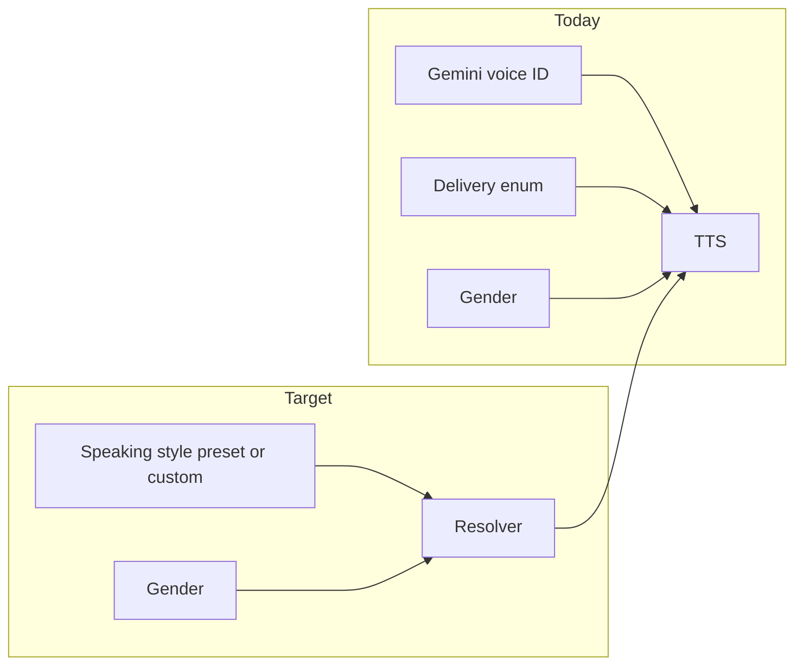
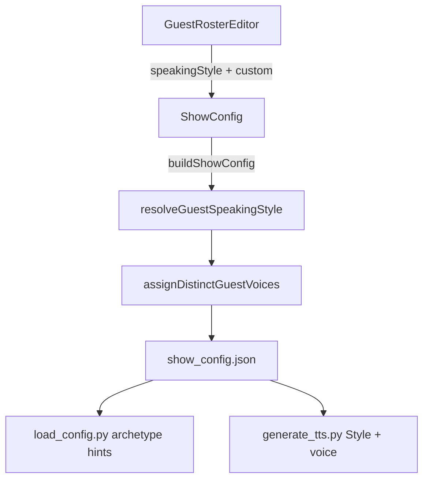

# Combine Guest Voice + Delivery into Speaking Style

## Problem

In [`src/components/GuestRosterEditor.tsx`](src/components/GuestRosterEditor.tsx), each guest card exposes two overlapping controls:

- **Voice** — Gemini voice IDs with gendered labels from [`VOICE_LABELS`](src/showConfig.ts) (e.g. "Warm male", "Crisp female")
- **Delivery** — enum from [`HOST_DELIVERIES`](src/showConfig.ts) (`measured`, `energetic`, `late-night`, `hype`)

These compete with separate **Gender**, **Accent**, **Persona**, **Location**, and **Audio treatment** fields. Users cannot freely describe a style, and gender is baked into voice labels even though gender is chosen elsewhere.



**Confirmed scope:** apply to both **guided** (archetypes) and **fixed** (roster) modes. Host settings in [`src/App.tsx`](src/App.tsx) stay unchanged.

---

## Target UX

Replace the two dropdowns with one field in [`GuestRosterEditor.tsx`](src/components/GuestRosterEditor.tsx):

| Control | Behavior |
|---------|----------|
| **Speaking style** (single `<select>`) | Preset list + **Custom** |
| **Custom text input** | Shown only when "Custom" is selected; free-form description |

### Preset list (gender-neutral, non-overlapping)

Curated in new `GUEST_SPEAKING_STYLES` constant in [`src/showConfig.ts`](src/showConfig.ts). Labels describe **pace + tone only** — no gender, accent, location, persona, or audio-treatment wording.

| Preset value | UI label | Internal mapping |
|--------------|----------|------------------|
| `auto` | Auto-assign | No style override; voice from gender via existing auto-assign |
| `warm-measured` | Warm & measured | delivery: `measured`; voice hint: warm (Puck/Kore by gender) |
| `warm-energetic` | Warm & energetic | delivery: `energetic`; voice hint: warm |
| `clear-conversational` | Clear & conversational | delivery: `measured`; voice hint: clear |
| `unhurried` | Unhurried & relaxed | delivery: `late-night`; voice hint: low-register (Charon/Kore) |
| `high-energy` | High-energy & upbeat | delivery: `hype`; voice hint: bold (Fenrir/Kore) |
| `soft-spoken` | Soft-spoken & thoughtful | delivery: `measured`; voice hint: soft |
| `assertive` | Assertive & direct | delivery: `energetic`; voice hint: authoritative |
| `custom` | Custom… | Uses `speakingStyleCustom` text in script + TTS notes |

When **Custom** is selected, placeholder text like `"e.g. rapid-fire skeptic with dry humor"` — no validation beyond max length.

Remove the **duplicate voices** warning in the editor (users no longer pick Gemini IDs directly).

---

## Schema & resolution layer

### New guest fields ([`src/showConfig.ts`](src/showConfig.ts))

Add to `guestProfileSchema`:

```typescript
speakingStyle: z.enum(GUEST_SPEAKING_STYLE_VALUES).optional().default("auto"),
speakingStyleCustom: z.string().max(200).optional(),
```

Remove from guest schema (not host):

- `voice`
- `delivery`

Add helper:

```typescript
export function resolveGuestSpeakingStyle(guest: GuestProfile): {
  delivery?: HostDelivery;
  voiceHint?: "warm" | "clear" | "lowRegister" | "bold" | "soft" | "authoritative";
  customText?: string;
}
```

Add `GUEST_SPEAKING_STYLE_LABELS: Record<GuestSpeakingStyle, string>` for UI labels.

### Update voice auto-assign

Refactor [`assignDistinctGuestVoices`](src/showConfig.ts) to accept optional voice hints from `resolveGuestSpeakingStyle()` instead of explicit `guest.voice`. Gender still drives pool selection; hint picks preferred voice within pool (fallback to current round-robin if preferred voice is taken).

### Backward compatibility

Add `migrateGuestProfile(profile)` called from:

- `showConfigSchema` preprocess (or post-parse transform on roster entries)
- [`loadAdvancedSettings()`](src/showConfig.ts) before returning parsed localStorage

Migration rules:

- If `speakingStyle` already set → keep
- Else if both legacy `voice` + `delivery` present → map to closest preset, or `custom` with synthesized text (e.g. `"Puck voice, measured delivery"`)
- Else if only `delivery` → map delivery to closest preset
- Else if only `voice` → `custom` with voice label text (stripped of gender words where possible)
- Strip legacy `voice` / `delivery` keys after migration

---

## UI changes

**File:** [`src/components/GuestRosterEditor.tsx`](src/components/GuestRosterEditor.tsx)

- Remove Voice + Delivery `<select>` blocks (lines ~263–321)
- Add single **Speaking style** dropdown bound to `guest.speakingStyle`
- Conditionally render text input for `speakingStyleCustom` when value is `custom`
- Drop `getDuplicateVoices` helper and duplicate-voice warning (no longer user-facing)
- Remove unused imports: `GEMINI_VOICES`, `HOST_DELIVERIES`, `VOICE_LABELS`, `GeminiVoice`, `HostDelivery`

Layout: place Speaking style in the same grid slot where Voice was; custom input spans full width below when active.

---

## Pipeline updates

These files currently read `guest.voice` / `guest.delivery` for guests:

| File | Change |
|------|--------|
| [`agent/skills/show-production/scripts/load_config.py`](agent/skills/show-production/scripts/load_config.py) | `_format_guest_archetype`: emit `speaking style: <label or custom text>` instead of separate delivery; drop voice from archetype lines |
| [`agent/skills/tts-generation/scripts/generate_tts.py`](agent/skills/tts-generation/scripts/generate_tts.py) | `build_guest_profiles`: Style line from resolved delivery/custom; `build_roster_lookups`: resolve voice from speaking-style hint + gender (mirror TS logic, or read pre-resolved voice if server writes it) |
| [`agent/skills/metadata-generation/scripts/generate_metadata.py`](agent/skills/metadata-generation/scripts/generate_metadata.py) | Replace guest `voice`/`delivery` in speaker output with `speakingStyle` + optional `speakingStyleCustom` |
| [`server/lib/showConfigPrompt.ts`](server/lib/showConfigPrompt.ts) | Roster summary uses speaking style label |
| [`src/types.ts`](src/types.ts) | Update `GuestProfileSummary` |

**Recommended approach for Python parity:** duplicate a small `SPEAKING_STYLE_MAP` dict in `load_config.py` / `generate_tts.py` matching the TS resolver (same preset keys → delivery + voice hint). Alternatively, resolve at config build time in TS so `show_config.json` written to workspace includes computed `voice` + `delivery` for guests — but that hides the new field from the agent. Prefer explicit `speakingStyle` in JSON + shared mapping in Python.

[`buildShowConfig`](src/showConfig.ts) already calls `assignDistinctGuestVoices` — extend it to apply speaking-style voice hints before persisting roster to workspace.

---

## Data flow (after change)



---

## Files to touch

1. [`src/showConfig.ts`](src/showConfig.ts) — constants, schema, resolver, migration, assignDistinctGuestVoices
2. [`src/components/GuestRosterEditor.tsx`](src/components/GuestRosterEditor.tsx) — UI
3. [`src/types.ts`](src/types.ts) — summary types
4. [`server/lib/showConfigPrompt.ts`](server/lib/showConfigPrompt.ts) — agent prompt roster line
5. [`agent/skills/show-production/scripts/load_config.py`](agent/skills/show-production/scripts/load_config.py)
6. [`agent/skills/tts-generation/scripts/generate_tts.py`](agent/skills/tts-generation/scripts/generate_tts.py)
7. [`agent/skills/metadata-generation/scripts/generate_metadata.py`](agent/skills/metadata-generation/scripts/generate_metadata.py)

No host UI or host schema changes.

---

## Verification

- Open Advanced panel → Guests → Guided or Fixed: confirm single Speaking style dropdown, Custom reveals text input
- Confirm Gender / Accent / Location / Persona / Audio treatment are unchanged and presets do not mention them
- Load a saved config with old `voice`/`delivery` in localStorage → fields migrate without validation errors
- Generate a show with a preset guest and a custom guest → script instructions and TTS notes include speaking style; voices auto-assigned by gender + hint
