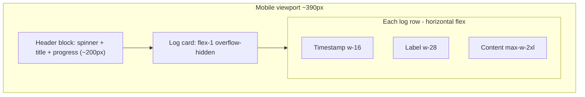
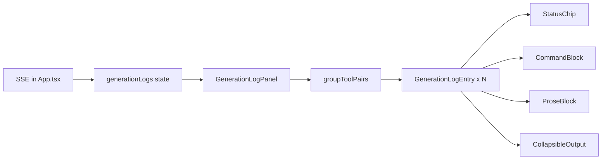

# Live Log Observability Redesign

## Problem diagnosis

The live log UI lives inline in [`src/App.tsx`](src/App.tsx) (`renderGenerationLogEntries`, lines ~1526–1611) inside a fixed-height terminal card. Content is good; layout and typographic hierarchy are the issues.

**Why it feels “cut off” on mobile**



- Fixed columns (`w-16` + `w-28`) consume ~144px before any content on narrow screens.
- Content is capped with `max-w-2xl` inside a row that already lacks width.
- Parent uses `overflow-hidden` + `no-scrollbar`, so clipped content has no visual affordance.
- Completion screen wraps the same panel in `max-h-[40vh]` ([`ShowReadyScreen.tsx`](src/components/ShowReadyScreen.tsx) line 101), aggressively truncating history.
- Header block (spinner, stage title, progress bar) competes with the log for vertical space during active generation.

**Why log types blur together**

Six SSE-driven types (`info`, `thinking`, `text`, `tool_call`, `tool_result`, `error`) are flattened into a single row template. `thinking` and `text` both render as “Log”. Long `tool_result` entries (pip installs, search JSON) use the same weight as one-line status messages. Commands and agent prose both use `font-mono`.

Real log sample from [`runtime_logs/`](runtime_logs/) shows the mix: status lines, long planning paragraphs, shell commands, and multi-hundred-line pip output—all visually equivalent.

---

## Proposed visual model: Activity Feed

Replace the terminal table with a **vertical timeline of cards**, each with a category-specific treatment. Narrative content uses sans-serif; commands/output use mono.

### Category map

| Category | Source types | Label | Visual treatment |
|----------|-------------|-------|------------------|
| **Status** | `info` | Status | Compact inline chip, no card wrapper, muted gray |
| **Planning** | `thinking` | Planning | Left violet accent bar, sans-serif, italic; collapsed to 2 lines by default with “Show more” |
| **Agent** | `text` | Agent | Left white/blue accent bar, sans-serif prose |
| **Command** | `tool_call` (bash/code) | Command | Terminal block: dark bg, `$` prompt prefix, mono, horizontal scroll |
| **File action** | `tool_call` (read_file/list_files/write) | File | Compact row: icon + humanized action + path pill |
| **Output** | `tool_result` | Output | Collapsible `<pre>`: show 4 lines + “Show full output (N lines)”; green/red header by success |
| **Error** | `error` | Error | Red accent card, always expanded |

### Grouping (reduces noise)

Pair consecutive `tool_call` + `tool_result` with the same tool name into a single **Action card**:

```
┌─ Run command ─────────────────────┐
│ $ python3 generate_script.py ...  │
│ ▼ Output (12 lines)               │
└───────────────────────────────────┘
```

This cuts duplicate headers (“Action” then “Result”) and makes cause/effect scannable.

### Mobile layout (primary fix)

**Active generation screen** ([`App.tsx`](src/App.tsx) ~1721–1768):

- Switch outer layout to `flex flex-col h-dvh` (dynamic viewport height) instead of centering with competing blocks.
- **Compact header on mobile**: single row with spinner + stage label + slim progress; move prompt subtitle behind a tap-to-expand or truncate to one line.
- **Log panel becomes primary**: `flex-1 min-h-0` with `min-h-[55dvh]` on mobile so it owns most of the screen.
- **Card stack**: each entry is full-width (`w-full`), stacked vertically—timestamp + badge on top row, body below (no fixed side columns).
- **Scroll affordance**: replace hidden scrollbar with a bottom fade gradient + floating “Jump to latest” pill when `!isScrolledToBottom` (logic already exists at lines 1513–1524).
- **Padding**: `p-3 sm:p-6` on log scroll area; remove `max-w-2xl` on mobile.

**Completion screen** ([`ShowReadyScreen.tsx`](src/components/ShowReadyScreen.tsx)):

- Change log wrapper from `max-h-[40vh]` to `min-h-[50dvh] max-h-[70dvh]` so post-build review is usable on phone.
- Optional: “Expand log” button opens log in a full-screen overlay on mobile.

### Desktop layout

Keep timeline feel but widen content: badge column becomes a small top-left chip inside each card rather than a fixed `w-28` column. Max width stays `max-w-4xl` for the panel, cards use full inner width.

### Optional filter bar (recommended, low cost)

Sticky bar inside log header:

- **All** | **Status** | **Actions** | **Agent**
- **Hide verbose** toggle (default ON on mobile): hides `thinking` and auto-collapses long `tool_result`

Stored in local component state only—no backend changes.

---

## Architecture change

Extract log UI from the 2900-line `App.tsx` into focused components:

```
src/components/generation-log/
  types.ts              # GenerationLogEntry union (replace inline state type)
  logFormatting.ts      # scrubText, humanizeToolName, formatToolResult (move from App)
  GenerationLogEntry.tsx
  GenerationLogPanel.tsx
  useGenerationLogScroll.ts
```

[`App.tsx`](src/App.tsx) keeps SSE consumption + `generationLogs` state; passes logs into `<GenerationLogPanel />`.



No server/SSE changes required—all differentiation is client-side from existing `type`, `name`, `args`, `result`, `content` fields.

---

## Key implementation details

### 1. `GenerationLogEntry` responsive structure

```tsx
// Mobile-first card (conceptual)
<article className="rounded-xl border border-white/8 bg-white/[0.03] p-3 sm:p-4">
  <header className="flex items-center gap-2 mb-2">
    <CategoryBadge type={...} />
    <time className="text-[10px] text-white/40 font-mono ml-auto">{timestamp}</time>
  </header>
  <div className="min-w-0">{body}</body>
</article>
```

- `min-w-0` on flex children prevents text overflow clipping without horizontal cut-off.
- Long `<pre>` blocks: `overflow-x-auto` with `-webkit-overflow-scrolling: touch`.

### 2. Collapsible verbose output

- Threshold: collapse when result/content exceeds ~300 chars or 6 newline-separated lines.
- Use `<details>`/`<summary>` or a small `useState` expand toggle per entry (prefer button for consistent styling).
- Show line count in summary: “Show full output (142 lines)”.

### 3. Typography split

- `thinking` / `text` / `info`: `font-sans text-sm leading-relaxed`
- `tool_call` commands / `tool_result`: `font-mono text-xs sm:text-sm`
- Bump minimum mobile size from `text-xs` to `text-sm` for prose entries.

### 4. `groupToolPairs` helper

Walk `generationLogs` array; when `tool_call` at index `i` is followed by matching `tool_result` at `i+1`, emit a grouped `ActionGroup` item instead of two separate entries. Unpaired entries render as today.

### 5. Preserve existing behavior

- Auto-scroll to bottom when user is at bottom (existing `scrollRef` + `isScrolledToBottom`).
- `downloadLogs` format unchanged.
- `scrubText` API key redaction unchanged.
- Empty `tool_call` args still filtered out.

---

## Files to touch

| File | Change |
|------|--------|
| [`src/App.tsx`](src/App.tsx) | Remove inline renderer/helpers; import `GenerationLogPanel`; adjust generating layout for mobile-first |
| [`src/components/ShowReadyScreen.tsx`](src/components/ShowReadyScreen.tsx) | Relax `max-h-[40vh]`; optional full-screen log overlay |
| `src/components/generation-log/*` (new) | Entry components, formatting helpers, scroll hook |
| [`src/index.css`](src/index.css) | Optional: `.log-scroll-fade` utility for bottom gradient |

No changes to [`server.ts`](server.ts) or [`server/lib/agentClient.ts`](server/lib/agentClient.ts).

---

## Visual reference (target)

**Mobile active generation**

```
┌─────────────────────────────┐
│ ◉ Writing script    ████░░  │  ← compact header
├─────────────────────────────┤
│ [Status] 15:55:34           │
│ Provisioning environment…   │
│                             │
│ ┌ Planning ───────────────┐ │
│ │ Considering the café…   │ │
│ │ Show more               │ │
│ └─────────────────────────┘ │
│                             │
│ ┌ Command ────────────────┐ │
│ │ $ pip install -r …      │ │
│ │ ▶ Output (28 lines)     │ │
│ └─────────────────────────┘ │
│                             │
│        ▼ Jump to latest     │  ← when scrolled up
└─────────────────────────────┘
```

---

## Testing

- Manual: resize browser to 375px width during generation; confirm no horizontal clipping, readable prose, collapsible long output.
- Optional Playwright smoke: mock SSE stream with mixed event types; assert category badges and collapse controls render (`data-testid` on panel, entries, expand buttons).

---

## Scope boundaries (out of scope)

- Changing SSE event schema or server-side log shaping
- Persisting filter preferences across sessions
- Syntax highlighting for Python/bash (nice-to-have later)
