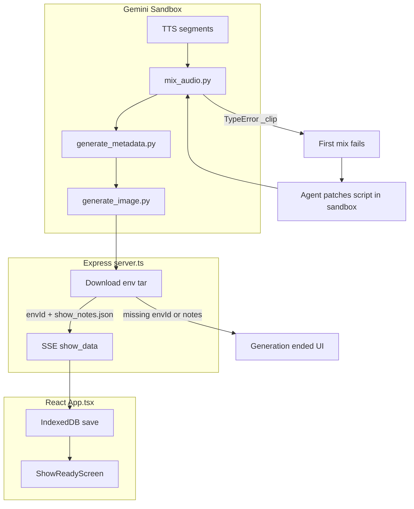
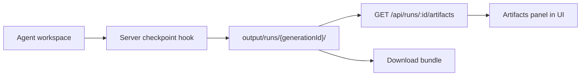

# Runtime Log Analysis and Improvement Plan

## Log Summary

| Log | Outcome | Root issue |
|-----|---------|------------|
| [`runtime_logs/agent-logs-2026-06-28T15-38-18.335Z.txt`](runtime_logs/agent-logs-2026-06-28T15-38-18.335Z.txt) | Failed in ~7s | Gemini spend cap / quota — no pipeline started |
| [`runtime_logs/agent-logs-2026-06-28T15-52-31.185Z.txt`](runtime_logs/agent-logs-2026-06-28T15-52-31.185Z.txt) | No show delivered | Reached metadata (~15:52), log ends before cover image; likely timeout/interrupt before server tar download |
| [`runtime_logs/agent-logs-2026-06-28T16-05-40.896Z.txt`](runtime_logs/agent-logs-2026-06-28T16-05-40.896Z.txt) | Agent reports success, user got nothing | Pipeline produced `ai_radio.mp3` + `show_notes.json` in sandbox, but client never received `show_data` |

Both “late-stage” runs share the same **hard blocker**: `mix_audio.py` crashes on manifest serialization.



---

## Part 1 — Decisive Root-Cause Fixes (high confidence)

These are bugs confirmed in **both logs and the repo**. Fixing them in [`agent/`](agent/) (deployed via `loadAgentFiles` in [`server.ts`](server.ts)) prevents the orchestrator agent from burning tokens on sandbox patches.

### P0 — Fix `mix_audio.py` manifest crash (blocks delivery)

**Evidence:** Both runs hit `TypeError: Object of type AudioSegment is not JSON serializable` at `save_manifest`.

**Root cause:** [`agent/skills/audio-mixing/scripts/mix_audio.py`](agent/skills/audio-mixing/scripts/mix_audio.py) attaches `_clip` pydub objects onto timeline events, then passes the same list to `build_manifest()` without stripping them:

```256:258:agent/skills/audio-mixing/scripts/mix_audio.py
    master = master.fade_in(500).fade_out(2000)
    manifest = build_manifest(events, len(master))
    return master, manifest
```

**Fix:** Before `build_manifest`, delete `_clip` from every event (or deep-copy events for mixing vs manifest). Add a unit test that serializes the manifest.

**Complexity:** Low | **Confidence:** 98%

---

### P0 — Add `direct_audio.py` to the server prompt sequence

**Evidence:** [`server/lib/showConfigPrompt.ts`](server/lib/showConfigPrompt.ts) skips step 4 (`direct_audio.py`) while [`agent/AGENTS.md`](agent/AGENTS.md) requires it. Both logs show the agent discovering this mid-run and spending many thinking/tool cycles.

**Fix:** Insert between script review and TTS:

```ts
python3 /.agents/skills/show-production/scripts/direct_audio.py --workspace ./workspace --config ./workspace/data/show_config.json
```

Renumber subsequent steps. Optionally skip when `realism.enabled === false`.

**Complexity:** Low | **Confidence:** 95%

---

### P0 — Harden server delivery when sandbox succeeds

**Evidence:** Log `16-05-40` ends with agent success text and files present in workspace, but [`src/App.tsx`](src/App.tsx) only saves a show on `show_data`. If `envId` is missing or tar lacks `show_notes.json`, server sends `status: completed` with **no show** — user lands on “Generation ended”.

**Fix in [`server.ts`](server.ts):**
- If tar download succeeds but `show_notes.json` is missing, attempt recovery: parse `timeline_manifest.json` + `script.md` into minimal show payload, attach audio/cover if present.
- If `envId` is missing after `complete`, emit explicit SSE error (not silent completion).
- Log and surface tar file listing on failure for debugging.

**Complexity:** Medium | **Confidence:** 90%

---

### P1 — Fix cover image generation (consistently fails)

**Evidence (log `16-05-40`):**
- `gemini-3.1-flash-image` → client timeout (60s)
- `gemini-3.1-pro-image` → **404** (invalid model name)
- Script exits 0 → no cover → Unsplash fallback only if show delivers

**Fix in [`agent/skills/cover-image-generation/scripts/generate_image.py`](agent/skills/cover-image-generation/scripts/generate_image.py):**
- Replace fallback model with a valid name from [Gemini models docs](https://ai.google.dev/gemini-api/docs/models) (e.g. `gemini-3.1-pro-preview` image-capable variant, verify against current API).
- Increase HTTP timeout (120s+); align with existing SIGALRM.
- Read station name from `show_config.json` / metadata instead of hardcoded `"AI Talk Radio"` in `BASE_PROMPT`.
- On total failure: generate deterministic local fallback (ffmpeg solid color + title text, or bundled template PNG) — **do not rely on agent improvisation**.

**Complexity:** Low–Medium | **Confidence:** 85% (model names must be verified against live API)

---

### P1 — Stop `script_review.py` from destroying customized scripts

**Evidence (both runs):** Review fails on content safety / word limits → auto-runs full `generate_script.py --revision` → overwrites user-specific station ID, sponsor, and host names with generic “AI Talk Radio” output. Agent then spends ~20+ minutes fighting the pipeline.

**Fix in [`agent/skills/show-production/scripts/script_review.py`](agent/skills/show-production/scripts/script_review.py):**
- On failure: write `script_review.json` with issues and **exit non-zero** (or add `--no-auto-revise` default).
- Move auto-revision behind an explicit flag; revision should edit in-place via a smaller LLM patch prompt, not full regeneration.
- Merge user `toneContext`, `topic`, and enabled features (`stationId`, `mockSponsorRead`) into `REVIEW_PROMPT` so permitted mature/sponsor content is not flagged when configured.

**Complexity:** Medium | **Confidence:** 88%

---

### P1 — Make `generate_script.py` honor show config branding

**Evidence:** Generated scripts ignore KWOM, Bobette/Samanta, sponsor reads; hardcode “AI Talk Radio” in [`build_base_prompt()`](agent/skills/script-writing/scripts/generate_script.py).

**Fix:**
- Inject `config.topic` as a mandatory “Show topic” block in the system prompt.
- When `features.stationId` / custom station fields exist, require those call letters (extend [`load_config.build_segment_instructions()`](agent/skills/show-production/scripts/load_config.py) or add `build_branding_instructions()`).
- Add explicit rule: “Never mention AI, automation, or AI Talk Radio unless in config.”
- Align `CONTENT_SAFETY` with user-configured mature themes when `toneContext` or sponsor feature enables them.

**Complexity:** Medium | **Confidence:** 85%

---

### P2 — Fix false-negative quality check

**Evidence:** Log `16-05-40` reports “No TTS segments found” while 16 WAV files exist under `audio/segments/`.

**Root cause:** [`quality_check.py`](agent/skills/show-production/scripts/quality_check.py) checks `audio/speech/segments/` but timeline `clipRef` uses `segments/` (consistent with [`direct_audio.py`](agent/skills/show-production/scripts/direct_audio.py)).

**Fix:** Check `audio/segments/` (or both paths). Do not mark `passed: false` for path mismatch alone.

**Complexity:** Low | **Confidence:** 95%

---

### P2 — Pre-flight quota gate

**Evidence:** Log `15-38-18` provisions environment then immediately fails on spend cap.

**Fix:** Before `createInteraction`, call a lightweight Gemini quota/billing probe (or track prior 429s). Return actionable SSE error without starting the agent.

**Complexity:** Low | **Confidence:** 90%

---

## Part 2 — Token Usage Efficiency Opportunities

Token spend has **two layers**: (A) orchestrator agent (`antigravity-preview-05-2026`, logged in server console only), (B) Python skill scripts (not logged today).

| Improvement | Est. savings | Complexity | Confidence | Notes |
|-------------|-------------|------------|------------|-------|
| Fix repo bugs so agent stops reading/patching scripts | **Very high** (30–50% orchestrator tokens) | Low–Med | 95% | Biggest win; both logs show agent rewriting `mix_audio.py`, `script_review.py`, `generate_script.py` |
| Add `direct_audio.py` to prompt | High | Low | 95% | Eliminates discovery loops |
| Tighten [`agent/AGENTS.md`](agent/AGENTS.md): forbid editing skill scripts; chain commands with `&&` | High | Low | 90% | Reduces exploratory `read_file` calls |
| Metadata: use `timeline_manifest.json` timecodes, skip audio upload to Files API | High per run | Medium | 90% | [`generate_metadata.py`](agent/skills/metadata-generation/scripts/generate_metadata.py) uploads full MP3 then asks Gemini to re-timecode — redundant when manifest exists (lines 308–310 already prefer manifest when present; make upload conditional) |
| Script review: deterministic checks only; LLM review optional/on-failure | Medium | Medium | 85% | Saves one full-script LLM call per run |
| Script review: no full regeneration on fail | Medium | Medium | 88% | Prevents duplicate `generate_script` calls (2–3× in logs) |
| Skip `generate_music.py` when `music.enabled === false` | Low–Med | Low | 95% | Prompt always runs music step today |
| Research: prefer `fetch_*.py` scripts over agent Google Search | Low–Med | Low | 80% | Agent bypasses research scripts in logs |
| Cache static portions of script/TTS prompts across events | Medium | Medium | 75% | TTS is per-segment; batch or template caching needs API support |
| Log Python script token usage (Interactions API usage field) | N/A (observability) | Low | 90% | Enables data-driven tuning |
| Reduce orchestrator thinking surface: shorter prompt, fewer SKILL.md cats | Low–Med | Low | 70% | Trade-off vs agent autonomy |

**Recommended first token pass:** repo bug fixes + prompt alignment + metadata audio-upload skip. These are low-risk and address observed waste directly.

---

## Part 3 — Asset Access, Download, and Recoverability

### Are assets from the two latest test runs still available?

**Almost certainly no.**

| Asset | Run 15-52 | Run 16-05 | Where it would live |
|-------|-----------|-----------|---------------------|
| `ai_radio.mp3` | Likely yes in sandbox at metadata stage | Yes (4.1–5.3 MB, confirmed in log) | Ephemeral Gemini env — **destroyed after interaction** |
| TTS segments | Yes (16/17) | Yes (16 WAV under `audio/segments/`) | Same — gone |
| `show_notes.json` | Generated | Generated | Same — gone |
| `cover.png` | Not reached | Placeholder orange PNG via ffmpeg | Same — gone |
| Browser library | No | No | IndexedDB only populated on `show_data` |
| Server disk | No | No | [`server.ts`](server.ts) never writes workspace to `output/`; only in-memory tar at end |

**What you still have:** the runtime log files themselves (valuable for debugging), and any server console output if preserved separately.

---

### Proposed solution: Run Artifact Vault

**Goal:** Any “usable” asset produced during a run remains downloadable even if the final show fails to deliver.



**Phase A — Server-side persistence (recommended first)**

1. **On `interaction.complete`** (and optionally on unrecoverable error if env still accessible): download env tar to `output/runs/{generationId}/workspace.tar`.
2. **Extract selectively** to `output/runs/{generationId}/`:
   - Always: `audio/final/ai_radio.mp3`, `data/show_notes.json`, `data/script.md`, `images/cover.png`, `data/quality_report.json`, `data/audio_timeline.json`
   - Optional: `audio/segments/*.wav`, `audio/music/background.mp3`
3. **New endpoints:**
   - `GET /api/runs/:generationId` — manifest (stage reached, file list, errors)
   - `GET /api/runs/:generationId/files/:path` — download single file
   - `GET /api/runs/:generationId/bundle` — ZIP of all usable assets
4. **Retention:** extend [`cleanUpOldGenerations()`](server.ts) to keep `output/runs/` for 7–30 days (configurable), separate from 1-hour legacy cleanup.
5. **Client UI:** on “Generation ended” without show, show **Download partial assets** if vault entry exists; add `script.md` to bundle (currently excluded from [`handleDownload`](src/App.tsx)).

**Phase B — Mid-run checkpoints (optional, higher value)**

- After each major stage completes (detect via tool_result patterns in SSE), trigger incremental env snapshot.
- Expensive (multiple tar downloads) — only enable in dev or on explicit “save intermediates” flag.

**Phase C — Cloud persistence (if GCS already configured for shares)**

- Mirror vault to `runs/{generationId}/` in existing GCS bucket for cross-device access.

**Complexity:** Phase A = Medium | **Confidence:** 88%

---

## Recommended Implementation Order

1. **P0 bug fixes** — `mix_audio.py`, `showConfigPrompt.ts` `direct_audio`, `quality_check.py` path
2. **P0 delivery** — server recovery path + explicit failure when no `show_data`
3. **P1 cover image** — model names, timeout, local fallback
4. **P1 script pipeline** — config-aware script generation + non-destructive review
5. **Token pass** — metadata skip audio upload, AGENTS.md constraints, conditional music step
6. **Artifact vault Phase A** — so future failed runs remain recoverable

---

## Verification Plan

- Run a 5-minute show with the same KWOM / mature-sponsor config used in the logs.
- Confirm: mix completes without agent patching; music mixed when enabled; cover generated or fallback PNG created; client receives `show_data`.
- Induce failure (kill after mix): confirm `output/runs/{generationId}/` contains downloadable MP3.
- Compare orchestrator token log line before/after (server console).
