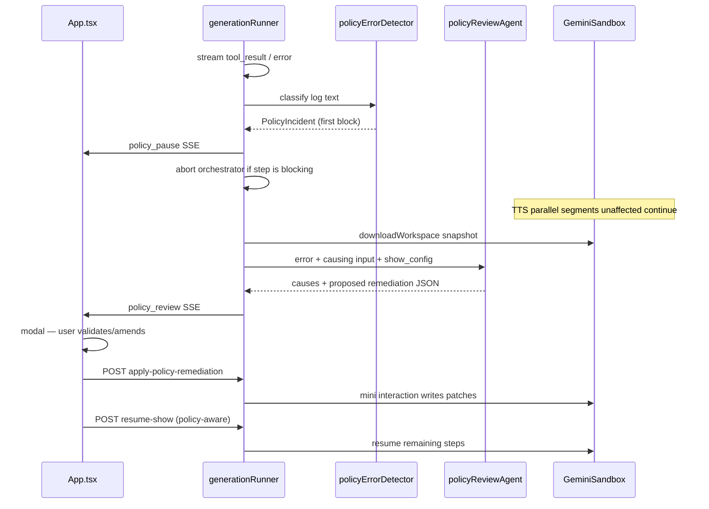

# Policy Error Remediation Flow

## Problem

Today, Google policy blocks (e.g. `Input blocked… Prohibited Use policy`) appear as generic `tool_result` / `error` log lines. The orchestrator agent often improvises by patching skill scripts ([runtime log evidence](runtime_logs/agent-logs-2026-06-28T16-05-40.896Z.txt)). TTS skips failed segments after 3 retries with no user-facing remediation ([`generate_tts.py`](agent/skills/tts-generation/scripts/generate_tts.py) L258–272). Quota errors are special-cased; policy errors are not.

## Target behavior



Per your timing preference: **trigger on the first policy-based error log**, but **only pause work that depends on the failing artifact** — independent parallel segments (e.g. other TTS events) may continue.

---

## 1. Policy error detection (server)

**New file:** [`server/lib/policyErrorDetector.ts`](server/lib/policyErrorDetector.ts)

- `detectPolicyError(text: string): PolicyDetection | null` — match provider signals, exclude quota patterns already handled in [`generationRunner.ts`](server/lib/generationRunner.ts) L284–293:
  - `input blocked`, `prohibited use`, `invalid_request`, `content policy`, `safety`, `blocked`
- Parse context from log text:
  - TTS event id: `[evt_008]`
  - Failing script: `generate_tts.py`, `generate_script.py`, etc.
  - Provider message excerpt
- `isQuotaError()` reuse / shared helper to avoid false positives

**Hook in** [`server/lib/generationRunner.ts`](server/lib/generationRunner.ts) inside the `for await` loop (L302–374):

- On `tool_result` and `error` events, run detector **before** forwarding to client
- On first policy hit for a generation:
  - Persist incident via store (below)
  - Emit `{ type: "policy_pause", incident: … }` (still forward original log entry)
  - Set checkpoint `status: "paused_policy"`
  - **Abort orchestrator** via existing `AbortSignal` when the failing step is **blocking** (script, review, metadata, cover — anything where downstream steps need the artifact)
  - For **TTS partial failures**: do **not** abort the whole run while `generate_tts.py` is in-flight; rely on skill-side behavior (section 2) to finish sibling segments, then pause at tool completion

**Also parse** top-level API errors in `createInteraction` non-OK responses and stream `error` events with `code: "policy"` when applicable.

---

## 2. Skill-side: structured policy errors + partial TTS continue

**Change** [`agent/skills/tts-generation/scripts/generate_tts.py`](agent/skills/tts-generation/scripts/generate_tts.py):

- Distinguish **policy blocks** from transient errors (string match on provider message)
- On policy block: **no retries**; immediately:
  - Print one machine-readable line: `POLICY_ERROR:{"eventId":"evt_008","speaker":"…","text":"…","providerMessage":"…"}`
  - Append to `workspace/data/policy_incidents.json`
  - Continue other segments in the thread pool
- At end: if any incidents → exit code `2` (policy partial); else `0`

**Optional same pattern** for [`generate_script.py`](agent/skills/script-writing/scripts/generate_script.py), [`generate_metadata.py`](agent/skills/metadata-generation/scripts/generate_metadata.py), [`generate_image.py`](agent/skills/cover-image-generation/scripts/generate_image.py) — exit `2` + `POLICY_ERROR:` JSON on API policy block.

Detector prefers parsing `POLICY_ERROR:` JSON over heuristics when present.

---

## 3. Incident + checkpoint persistence

**Extend** [`server/lib/checkpointStore.ts`](server/lib/checkpointStore.ts):

```ts
status: "running" | "failed" | "salvaged" | "completed" | "paused_policy"
policyIncidentId?: string
```

**New file:** [`server/lib/policyIncidentStore.ts`](server/lib/policyIncidentStore.ts) — `output/policy-incidents/{generationId}.json`

```ts
interface PolicyIncident {
  id: string;
  generationId: string;
  detectedAt: string;
  stepIndex: number;
  stepLabel: string;
  providerMessage: string;
  rawLogExcerpt: string;
  causingInput?: { source: "script" | "tts_prompt" | "show_config" | "metadata_prompt" | "image_prompt"; file?: string; eventId?: string; excerpt: string };
  environmentId?: string;
  review?: PolicyReviewResult;
  remediation?: PolicyRemediationPlan;
  status: "detected" | "reviewing" | "awaiting_user" | "applied" | "cancelled";
}
```

On detection, snapshot workspace via existing [`downloadWorkspace()`](server/lib/workspaceSalvage.ts) when `environmentId` is available; extract causing input:
- TTS: resolve `eventId` → text from `audio_timeline.json` / `script.md`
- Script: relevant lines from `script.md`
- Config: `show_config.json` fields (`topic`, `toneContext`, sponsor features)

---

## 4. Dedicated policy review agent

**New file:** [`server/lib/policyReviewAgent.ts`](server/lib/policyReviewAgent.ts)

- **Separate** from the orchestrator (`antigravity-preview-05-2026`) — a single non-streaming Gemini Interactions call with **JSON schema output** (no tools, no sandbox writes)
- Input bundle:
  - Provider error message
  - `show_config` summary
  - Causing input excerpt(s) with file/line/event references
  - Optional: neighboring script context (±2 lines)
- Output schema (`PolicyReviewResult`):

```ts
interface PolicyCause {
  id: string;
  confidence: "high" | "medium";
  source: "script_line" | "tts_text" | "topic" | "tone_context" | "sponsor_read" | "image_prompt";
  location: { file?: string; line?: number; eventId?: string };
  excerpt: string;
  triggerPhrases: string[];
  explanation: string; // plain language for UI
}

interface PolicyRemediationAction {
  id: string;
  type: "replace_text" | "update_config_field" | "skip_event" | "soften_sponsor_read";
  target: { file?: string; eventId?: string; configPath?: string };
  original: string;
  proposed: string;
  rationale: string;
}
```

- Run automatically after `policy_pause` (server-side, ~3–8s); emit `{ type: "policy_review", incidentId, review }` when complete
- If review fails, UI shows raw error + manual edit fallback

**New file:** [`server/lib/policyRemediationPrompt.ts`](server/lib/policyRemediationPrompt.ts) — builds the review system prompt with strict rules: cite exact phrases, propose minimal edits that preserve show intent, never suggest bypassing provider policy.

---

## 5. Apply remediation + resume

**New endpoint:** `POST /api/apply-policy-remediation` in [`server.ts`](server.ts)

Body: `{ generationId, incidentId, actions: PolicyRemediationAction[] }` (user-edited proposals)

Flow:
1. Load checkpoint + incident; validate `status === "awaiting_user"`
2. **Apply to sandbox** via a short `createInteraction()` reusing `environmentId`:
   - Prompt: apply exact file replacements to `workspace/data/script.md`, update `audio_timeline.json` event text, patch `show_config.json` if needed — **no skill script edits**
   - Wait for completion (non-streaming or short stream)
3. Update checkpoint `showConfig` if config fields changed; set incident `status: "applied"`
4. Return `{ ok: true }`

**Extend** [`server/lib/resumePrompt.ts`](server/lib/resumePrompt.ts) with `buildPolicyResumePrompt()`:

- If TTS partial failure: re-run `generate_tts.py` with new `--retry-events evt_008,evt_012` flag (add to script)
- Otherwise: resume from `lastCompletedStep` as today, but prepend: "Policy remediation applied — do NOT regenerate script from scratch; use patched files"

**Reuse** existing `POST /api/resume-show` — pass optional `policyIncidentId` to select policy-aware prompt builder.

---

## 6. Frontend: policy pause modal

**New types** in [`src/types.ts`](src/types.ts): `PolicyIncident`, `PolicyCause`, `PolicyRemediationAction`, extend `GenerationCheckpoint.status`.

**New component:** [`src/components/PolicyRemediationModal.tsx`](src/components/PolicyRemediationModal.tsx)

- `role="dialog"` overlay (pattern from [`QuickStartGuide`](src/components/QuickStartGuide.tsx))
- States: `reviewing` (spinner) → `awaiting_user`
- Shows:
  - Shield icon + "Content policy issue"
  - Step label where blocked
  - Causes list with confidence badges + highlighted `triggerPhrases`
  - Editable text fields per `proposed` replacement (user amend)
  - Actions: **Apply & Resume** | **Cancel show** | **Edit show settings** (navigate home with config preserved)

**Wire in** [`src/App.tsx`](src/App.tsx) SSE handler (~L1251):

| Event | Action |
|-------|--------|
| `policy_pause` | `setPolicyIncident(...)`, `setPolicyModalOpen(true)`, `setIsGenerating(false)` |
| `policy_review` | Merge review into incident state |
| (after apply) | Call `/api/resume-show`, reconnect SSE via existing `consumeGenerationResponse` |

Mirror handling in `consumeGenerationResponse()` for resume path.

**Do not** rely on client-side string matching alone — server emits typed events.

---

## 7. Orchestrator guardrails

Update [`agent/AGENTS.md`](agent/AGENTS.md) and [`server/lib/showConfigPrompt.ts`](server/lib/showConfigPrompt.ts):

- On `POLICY_ERROR` / exit code 2: **stop** — do not patch skill scripts; wait for server remediation (agent will be aborted anyway)
- Reinforce: failed TTS events must not be silently skipped when policy remediation is enabled (align with AGENTS.md rule 4)

---

## 8. Files to create / modify

| File | Change |
|------|--------|
| `server/lib/policyErrorDetector.ts` | **New** — detection + parsing |
| `server/lib/policyIncidentStore.ts` | **New** — persistence |
| `server/lib/policyReviewAgent.ts` | **New** — dedicated reviewer |
| `server/lib/policyRemediationPrompt.ts` | **New** — review/apply prompts |
| `server/lib/generationRunner.ts` | Detect, pause, trigger review |
| `server/lib/checkpointStore.ts` | `paused_policy` status |
| `server/lib/resumePrompt.ts` | Policy-aware resume + TTS retry flag |
| `server.ts` | `/api/apply-policy-remediation`, extend resume |
| `src/types.ts` | Policy types |
| `src/components/PolicyRemediationModal.tsx` | **New** UI |
| `src/App.tsx` | SSE + modal wiring |
| `agent/skills/tts-generation/scripts/generate_tts.py` | Policy fail-fast, incidents file, `--retry-events` |
| `agent/AGENTS.md` | Remediation handoff rules |

---

## 9. Verification

1. Reproduce KWOM / mature-sponsor config from runtime logs — confirm TTS policy block opens modal with `evt_*` cause and script excerpt
2. Confirm other TTS segments complete while modal is open (parallel workers)
3. User edits proposed rephrase → Apply & Resume → failed events regenerate → show delivers
4. Confirm quota errors still use existing banner (no policy modal)
5. Confirm orchestrator does not edit `script_review.py` after policy pause (aborted)

---

## Risks / edge cases

- **Streaming granularity:** If the managed agent does not stream partial `tool_result` stdout, “first log line” detection for TTS only fires when each worker prints `POLICY_ERROR` — skill-side unbuffered `print(..., flush=True)` mitigates this; full tool_result still arrives at bash end
- **Sandbox write-back:** No direct file-upload API — remediation apply uses a brief agent interaction (same pattern as resume); keep patches small and deterministic
- **Unrecoverable content:** Review agent sets `recoverable: false` → modal shows “cannot proceed” with cancel only (no auto-bypass)
- **Client disconnect:** Incident persists in `output/policy-incidents/`; user can return via checkpoint within 24h TTL
