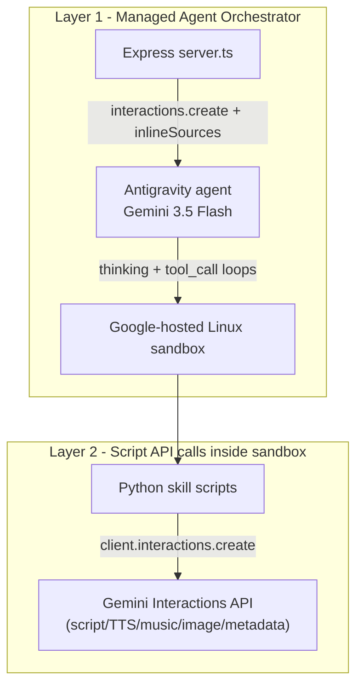
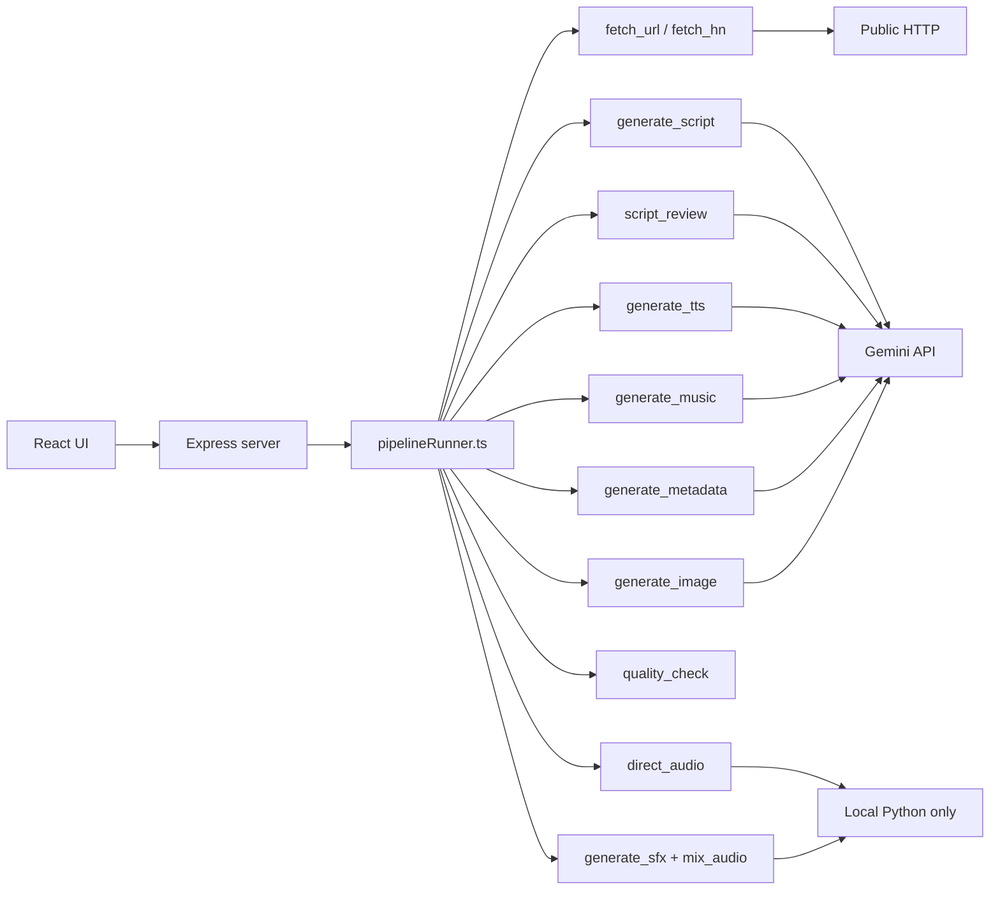

# Alternatives to Gemini-Managed Python Execution

## Current architecture (what costs money today)

The app has **two distinct Gemini cost layers**, both billed to the same `GEMINI_API_KEY`:

**Layer 1** ([`server/lib/agentClient.ts`](server/lib/agentClient.ts), [`server/lib/generationRunner.ts`](server/lib/generationRunner.ts)): One long Antigravity interaction. The agent reads [`agent/AGENTS.md`](agent/AGENTS.md), all SKILL.md files, runs `code_execution_call`, `read_file`, Google Search, and re-ingests every tool result into context. Google bills **all reasoning + tool I/O tokens** at Gemini 3.5 Flash rates ([official pricing](https://ai.google.dev/gemini-api/docs/pricing): **$1.50/M input, $9.00/M output including thinking**). Sandbox CPU/RAM is **free during preview**.

**Layer 2** (Python scripts under [`agent/skills/`](agent/skills/)): Scripts call Gemini directly for creative work. These costs **persist even if you stop using the Managed Agent**, as long as you keep the same models.

| Script | Uses Gemini? | Model / product |
|--------|--------------|-----------------|
| `fetch_hn.py`, `fetch_github.py`, `fetch_url.py` | No | HTTP only |
| `direct_audio.py`, `generate_sfx.py`, `mix_audio.py`, `quality_check.py`, `load_config.py`, `audio_timeline.py` | No | Pure Python + pydub/ffmpeg |
| `generate_script.py` | Yes | `gemini-3.5-flash` |
| `script_review.py` | Yes | `gemini-3.5-flash` (+ may re-run script gen) |
| `generate_tts.py` | Yes | `gemini-3.1-flash-tts-preview` |
| `generate_music.py` | Yes | `lyria-3-clip-preview` ($0.04/clip) |
| `generate_metadata.py` | Yes | `gemini-3-flash-preview` (+ optional full MP3 upload) |
| `generate_image.py` | Yes | `gemini-3.1-flash-image` (~$0.045–0.067/image) |

**Important clarification:** Moving Python off Gemini eliminates **Layer 1** entirely. It does **not** automatically eliminate TTS/music/script/image costs unless you also swap those APIs.

---

## Real-life example from `runtime_logs/`

### Run A — [`agent-logs-2026-06-28T15-52-31.185Z.txt`](runtime_logs/agent-logs-2026-06-28T15-52-31.185Z.txt) (near-complete, ~10 min)

| Metric | Value |
|--------|-------|
| Wall time | 15:42:22 → 15:52:19 (~10 min) |
| `code_execution_call` | **36** |
| `[thinking]` blocks | **26** |
| `read_file` | **12** |
| Pipeline Python invocations | ~11 (script, review, direct_audio, tts, music, sfx, mix, quality, metadata ×2) |
| TTS speech events | **17** |
| Final audio | **4:36** |
| Agent work outside pipeline | Google Search research, manual `script.md` rewrite, read/repair `mix_audio.py`, wrong metadata `--config` then retry |

**Waste visible in logs:** Agent spent ~40% of steps on inspection, manual script edits, and debugging (`mix_audio.py` JSON serialization bug) instead of blindly chaining commands — each extra step adds orchestrator tokens.

### Run B — [`agent-logs-2026-06-28T16-05-40.896Z.txt`](runtime_logs/agent-logs-2026-06-28T16-05-40.896Z.txt) (problematic, higher cost)

| Metric | Value |
|--------|-------|
| `code_execution_call` | **55** (+53% vs Run A) |
| `[thinking]` blocks | **30** |
| `read_file` | **25** |
| Script generations | **4+** (policy failures + agent patched `generate_script.py` / `script_review.py`) |
| Agent script patches | Violates [`agent/AGENTS.md`](agent/AGENTS.md) “Do NOT patch skill scripts” — causes retries and token bloat |

This run illustrates why Managed Agent cost is **volatile**: failures and “helpful” agent debugging can **double orchestrator spend** without improving output.

### Run C — [`agent-logs-2026-06-28T15-38-18.335Z.txt`](runtime_logs/agent-logs-2026-06-28T15-38-18.335Z.txt)

Failed immediately on quota/spend cap — no pipeline output. Confirms billing is the primary operational constraint.

---

## Per-show cost model (5-minute show, ~17 TTS clips, music enabled)

Estimates use [Gemini Developer API pricing](https://ai.google.dev/gemini-api/docs/pricing) (paid tier, Jun 2026). Ranges reflect Run A (good) vs Run B (bad).

| Cost component | Low (Run A) | High (Run B) | Calculation basis |
|----------------|-------------|--------------|-------------------|
| **Managed Agent orchestrator** | **$1.20** | **$3.50** | Google cites $0.30–$1.30 for document workflows; this pipeline is multi-step with 300KB of inlined agent files + heavy tool I/O. Complex agentic runs: up to ~$5 ([Antigravity docs](https://ai.google.dev/gemini-api/docs/antigravity-agent)). |
| Script writing (`gemini-3.5-flash`) | $0.04 | $0.15 | 2–4 calls × ~6K in / ~1K out @ $1.50/$9 |
| Script review | $0.02 | $0.08 | 1–2 LLM review calls |
| TTS (`gemini-3.1-flash-tts-preview`) | $0.10 | $0.22 | ~17 clips, ~3–4 min speech → ~4,500–7,000 audio output tokens @ **$20/M audio** (25 tokens/sec) + text input @ $1/M |
| Music (Lyria 3 Clip) | $0.04 | $0.04 | Fixed **$0.04/song** |
| Cover image | $0.05 | $0.07 | ~1K image ≈ **$0.067** |
| Metadata | $0.02 | $0.10 | Manifest path is cheap; audio-upload path (Run A did this twice) adds ~276s × 2 × audio input tokens |
| Google Search (agent research) | $0.00 | $0.03 | First 5,000 queries/mo free across Gemini 3 |
| **Total per show** | **~$1.50** | **~$4.20** | |
| **Typical steady-state** | **~$2.00–$2.80** | | Assumes occasional retries, not full Run B chaos |

### Monthly projection

| Volume | Current (Managed Agent) | After local pipeline (hybrid, below) |
|--------|-------------------------|--------------------------------------|
| 20 shows/mo | $30 – $84 | $8 – $24 |
| 50 shows/mo | $75 – $210 | $20 – $60 |
| 100 shows/mo | $150 – $420 | $40 – $120 |

**Layer 1 (orchestrator) ≈ 55–75% of total spend** in normal runs — this is the primary savings target.

---

## Options (complexity, new costs, savings)

### Option 1 — Local Node pipeline runner (recommended hybrid)

**What:** Replace [`runGeneration`](server/lib/generationRunner.ts) Antigravity call with a deterministic **`pipelineRunner.ts`** that `spawn`s Python scripts in order (matching [`src/pipelineSteps.ts`](src/pipelineSteps.ts)), streams stdout to SSE, and keeps existing checkpoint/salvage/policy logic.

**Keep on Gemini (Layer 2 only):** `generate_script`, `script_review`, `generate_tts`, `generate_music`, `generate_metadata`, `generate_image`.

**Move off Gemini agent:** All deterministic scripts + research fetchers + orchestration.

| | |
|--|--|
| **Implementation complexity** | **Medium** (1–2 weeks). Reuse `PIPELINE_STEPS`, `resumePrompt.ts` command list, checkpoint store. Need Python 3 + ffmpeg on host. |
| **New infrastructure cost** | **$0–$25/mo**. Render free tier lacks reliable Python/ffmpeg; **Render Starter (~$7/mo)** or Docker on Fly/Railway (~$5–10/mo) is realistic. |
| **Gemini savings** | **$1.20–$3.50/show (~60–80%)** — eliminates Layer 1 entirely. |
| **Net savings @ 50 shows/mo** | **~$55–$175/mo** minus ~$7 hosting ≈ **$48–$168/mo** |
| **Reliability gain** | No agent script patching, no “read 10 files then decide” loops, predictable step timing. |

**Rationale:** Maximum savings for minimum quality loss. TTS/music/voices stay on Gemini where the product differentiation lives.

---

### Option 2 — Minimal-change optimization (stay on Managed Agent)

**What:** Tighten prompts, fix known bugs so the agent stops improvising (metadata `--config` confusion, missing `direct_audio.py`, `mix_audio.py` serialization, TTS output path vs `quality_check.py` path). Enforce strict command chain in [`buildAgentPrompt`](server/lib/showConfigPrompt.ts).

| | |
|--|--|
| **Complexity** | **Low** (2–5 days) |
| **New cost** | $0 |
| **Savings** | **$0.40–$1.50/show (~20–35%)** by reducing tool calls and duplicate metadata/TTS runs |
| **Limitation** | Layer 1 remains; cost still scales with agent “curiosity” |

---

### Option 3 — Full self-hosted media stack

**What:** Local pipeline (Option 1) **plus** replace Gemini media APIs:

| Replacement | Example | Quality | Cost |
|-------------|---------|---------|------|
| TTS | Piper / Coqui (local) or OpenAI `tts-1` | Lower (Piper) to comparable (OpenAI) | Piper: $0; OpenAI ~$0.015/min |
| Script LLM | Ollama (`llama3`, `mistral`) on GPU VPS | Good enough for scripts; more prompt tuning | VPS $20–50/mo |
| Music | Royalty-free loops (local files) | Less bespoke than Lyria | $0 |
| Image | Stable Diffusion / Flux on GPU | Comparable | Included in VPS |
| Metadata | Rule-based from `timeline_manifest.json` | Already supported in [`generate_metadata.py`](agent/skills/metadata-generation/scripts/generate_metadata.py) when manifest exists | $0 |

| | |
|--|--|
| **Complexity** | **High** (4–8 weeks) |
| **New cost** | **$20–50/mo** GPU VPS (or $0 CPU-only with quality drop) |
| **Gemini savings** | **~$1.50–$4.00/show (~85–95%)** |
| **Tradeoff** | Voice quality, music uniqueness, and script consistency are the main regressions |

---

### Option 4 — Cloud job worker (scalable variant of Option 1)

**What:** Same local pipeline logic, but run each show as a **Cloud Run Job** / **Fly Machine** / **Railway worker** with a shared workspace volume. Express enqueues jobs; worker runs Python and uploads artifacts.

| | |
|--|--|
| **Complexity** | **High** (3–5 weeks) |
| **New cost** | ~$5–30/mo base + ~$0.01–0.05/compute-minute per show |
| **Savings** | Same Gemini savings as Option 1 |
| **When worth it** | Multiple concurrent generations or production SaaS |

---

### Option 5 — Hybrid: local pipeline + agent fallback

**What:** Option 1 as default; invoke Antigravity **only** when a step fails twice or research needs open-ended web synthesis.

| | |
|--|--|
| **Complexity** | **Medium–High** |
| **Savings** | **~$1.00–$3.00/show average** (fallback ~5–10% of runs add ~$2) |
| **Benefit** | Keeps agent for edge cases without paying orchestrator tax on every happy path |

---

### Option 6 — Replace orchestrator with lightweight LLM router (no Managed Agent)

**What:** Use a cheap chat model (Gemini 3 Flash Lite / 2.5 Flash Lite) **only** to pick research source and map errors to remediation — not to execute Python. Execution remains deterministic.

| | |
|--|--|
| **Complexity** | **Medium** |
| **Savings** | **~$1.00–$2.50/show** vs full Antigravity (router uses ~10–30K tokens vs 500K–2M) |
| **New cost** | ~$0.01–0.05/show for router tokens |

---

## Recommended hybrid (Option 1 + pieces of Option 2)

**Move off Managed Agent (deterministic, no LLM):**
- `direct_audio.py`, `generate_sfx.py`, `mix_audio.py`, `quality_check.py`
- Research via `fetch_hn.py` / `fetch_github.py` / `fetch_url.py` (or server-side Firecrawl if URL-heavy)
- All orchestration / step gating / checkpointing

**Keep on Gemini API (quality-critical):**
- Script + review, TTS, Lyria music, cover image
- Metadata only when manifest missing (prefer manifest path to avoid MP3 upload — saves ~$0.03–0.08/show)

**Fix before or during migration (from logs):**
- [`mix_audio.py`](agent/skills/audio-mixing/scripts/mix_audio.py): strip `_clip` before manifest JSON (agent patched this twice in logs)
- [`generate_tts.py`](agent/skills/tts-generation/scripts/generate_tts.py) vs [`quality_check.py`](agent/skills/show-production/scripts/quality_check.py): align segment output paths
- [`generate_metadata.py`](agent/skills/metadata-generation/scripts/generate_metadata.py): always prefer manifest path when `timeline_manifest.json` exists

**Do not move yet (low savings, high risk):**
- TTS (Gemini TTS is already ~$0.10–0.22/show — cheap vs orchestrator)
- Music/image unless spend cap is critical

---

## Summary comparison

| Option | Complexity | New monthly cost | Savings vs today | Best for |
|--------|------------|------------------|------------------|----------|
| 1. Local pipeline (recommended) | Medium | $7–10 hosting | **60–80%** | Best ROI, keep quality |
| 2. Prompt/bug fixes only | Low | $0 | 20–35% | Quick win while planning migration |
| 3. Full self-host | High | $20–50 VPS | 85–95% | Zero Gemini dependency |
| 4. Cloud job worker | High | $5–30+ | 60–80% | Concurrent production |
| 5. Local + agent fallback | Med–High | $7–10 | 70–85% avg | Research-heavy topics |
| 6. Cheap LLM router | Medium | ~$0 | 50–70% | Middle ground |

---

## Suggested implementation sequence (if you proceed)

1. **Quick wins (Option 2):** Fix pipeline bugs from logs; force manifest-based metadata; shorten agent prompt to command chain only.
2. **Build `pipelineRunner.ts`:** Sequential Python execution with SSE step events; workspace under `output/runs/{generationId}/`.
3. **Swap entry point:** Feature flag `USE_LOCAL_PIPELINE` in [`server.ts`](server.ts) beside existing `runGeneration`.
4. **Deploy with Python:** Docker image (Node + Python 3.11 + ffmpeg) — Render free tier alone is insufficient.
5. **Measure:** Log per-step duration and estimated token/API cost; compare to Managed Agent baseline using the same show config.

No code changes are included in this plan — this is an investigation and decision document only.
