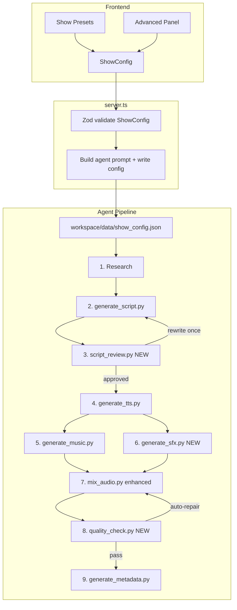
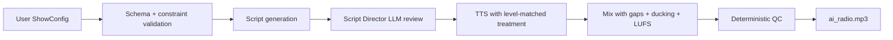

# Radio Show Customization & Production Quality Plan

## Current state

The app exposes only **topic**, **duration**, and **mood** in [`src/App.tsx`](src/App.tsx). The agent prompt in [`server.ts`](server.ts) is a single sentence — style, host, guests, and production are decided implicitly by the agent reading [`agent/AGENTS.md`](agent/AGENTS.md).

Hardcoded defaults today:

| Layer | Locked value | File |
|-------|-------------|------|
| Host name/persona | Paul, British studio host | [`generate_script.py`](agent/skills/script-writing/scripts/generate_script.py) |
| Host voice | `Puck` | [`generate_tts.py`](agent/skills/tts-generation/scripts/generate_tts.py) |
| Guests | LLM-generated; gender/accent tags only | script + TTS |
| Structure | Cold open → intro → main → closing | `STYLE_PROMPTS` in script-writing |
| Music | Lyria `chill` / `tech` / `debate` | [`generate_music.py`](agent/skills/music-generation/scripts/generate_music.py) |
| Mix | Fixed 15s intro/outro overlays | [`mix_audio.py`](agent/skills/audio-mixing/scripts/mix_audio.py) |

**Gap:** UI moods (`Informative`, `Late Night Chill`, etc.) do not map to pipeline `--style` or `--mood` flags.

---

## Target architecture



**Design principle:** User creativity lives in `ShowConfig`. The **Production Director** (script review + audio QC) enforces broadcast credibility so extreme configs still sound like a real show.

---

## 1. `ShowConfig` — single source of truth

Add [`src/showConfig.ts`](src/showConfig.ts) (types + Zod schema + preset definitions). Server imports the same schema for validation. Agent writes a copy to `workspace/data/show_config.json` before running skills.

### Core schema (illustrative)

```typescript
interface ShowConfig {
  version: 1;
  topic: string;
  durationMinutes: 3 | 5 | 10 | 15;
  presetId?: string;           // e.g. "late-night-debate"

  host: {
    name: string;              // default "Paul"
    persona: string;           // free text, e.g. "dry wit, NPR-style"
    accent: string;            // e.g. "British English, London"
    voice: GeminiVoice;        // Puck | Kore | Charon | Fenrir
    delivery: "measured" | "energetic" | "late-night" | "hype";
  };

  guests: {
    mode: "auto" | "guided" | "fixed";
    count?: number;              // 1–6, style-dependent defaults
    roster?: GuestProfile[];     // for guided/fixed
  };

  structure: {
    style: "debate" | "roundtable" | "interview" | "explainer";
    segments: SegmentConfig[];   // enable/disable + duration hints
  };

  features: RadioFeatures;
  music: { mood: "chill" | "tech" | "debate"; enabled: boolean };
  toneContext: string;         // maps UI mood → script --context
}
```

### Guest profiles (`GuestProfile`)

| Field | Purpose |
|-------|---------|
| `name` | Optional fixed name; auto if omitted |
| `persona` | e.g. "skeptical backend engineer" |
| `location` | Drives accent tag in script |
| `gender` | `male` / `female` / `unspecified` |
| `voice` | Optional Gemini voice override |
| `audioTreatment` | `phone` (default) / `studio` / `field` (heavier filter) |

**Guest modes:**
- **auto** — current behavior; LLM invents callers matching style
- **guided** — user sets count + archetype hints; LLM fills names/dialogue
- **fixed** — user defines full roster; script must use those speakers

### Segment model (`SegmentConfig`)

| Segment | Default | User control |
|---------|---------|--------------|
| `coldOpen` | 10s teaser | on/off, max seconds |
| `intro` | 15s welcome | on/off |
| `main` | bulk of show | style drives caller logic |
| `midShowRecap` | off | on/off — host summarizes halfway |
| `newsFlash` | off | 20–30s "breaking" interlude from research |
| `listenerMail` | off | host reads 1–2 pre-scripted "listener" questions |
| `closing` | 15s wrap | on/off, custom sign-off phrase |
| `stationId` | off | short "You're listening to…" bumper |

Segment durations are **hints**, not hard cuts — the Production Director enforces totals.

---

## 2. Proposed radio features (toggleable)

Each feature maps to script instructions + optional audio asset.

| Feature | Listener experience | Script change | Audio change |
|---------|--------------------|--------------|--------------|
| **Station ID** | Brand moment at top | Host reads call letters/tagline | TTS bumper + music sting |
| **Phone connect SFX** | Callers feel "live" | `[connect]` marker before first caller turn | 0.5s dual-tone beep |
| **Topic stingers** | Pacing between topics | `[stinger]` between debate rounds | Reuse Lyria clip, ducked |
| **Co-host** | Two studio voices | Second host banter in intro/outro | Studio voice, no phone filter |
| **Field reporter** | On-location feel | Reporter segment with location | Stronger bandpass + light reverb |
| **Mock sponsor read** | Classic radio ad slot | 15s fictional tech product (safe topics only) | Slight music bed, distinct delivery |
| **Listener mail** | Audience participation | Pre-written questions from "listeners" | Phone or studio per config |
| **Mid-show recap** | Helps long shows (10–15 min) | Host summarizes key points | None |
| **Sign-off catchphrase** | Memorable close | User-defined phrase in closing | None |
| **Background music** | Ambient bed | Existing | Existing Lyria + enhanced ducking |
| **Hold music** | Between segments | `[hold]` markers | Short ambient loop |

**Safety:** Mock ads and listener mail use only fictional sponsors and paraphrased listener text — no real brands, no PII. Reuse existing content-safety rules in [`AGENTS.md`](agent/AGENTS.md).

---

## 3. UI: presets + Advanced panel

Per your preference: keep the current compact generate form; add preset cards and a collapsible **Advanced** drawer.

### Show presets (bundled `ShowConfig` partials)

| Preset | Style | Host vibe | Guests | Features on |
|--------|-------|-----------|--------|-------------|
| **Tech Debate** | debate | measured British | 2 opposing/auto | phone SFX, topic stingers |
| **Roundtable Chill** | roundtable | conversational | 3–4 auto | background music, soft intro |
| **Deep Interview** | interview | curious, warm | 1 guided expert | minimal SFX |
| **Explainer Hour** | explainer | patient teacher | 2–3 auto | mid-show recap (10+ min) |
| **Late Night Labs** | roundtable | late-night dry wit | 2 auto | station ID, sign-off phrase |
| **Call-In Hotline** | debate | energetic | 4 guided | phone SFX, listener mail |

Preset selection pre-fills Advanced fields; user can override any field.

### Advanced panel sections

1. **Host** — name, persona textarea, voice picker (preview labels: warm male, crisp female, etc.), delivery style
2. **Guests** — mode selector; count slider; optional roster cards (add/remove guest)
3. **Structure** — style dropdown; segment toggles with duration sliders
4. **Radio features** — checkbox grid for features table above
5. **Music** — mood + on/off

Persist last-used Advanced settings in `localStorage` / IndexedDB via [`src/lib/clientDb.ts`](src/lib/clientDb.ts).

### Mood → pipeline mapping

Add explicit table in `showConfig.ts`:

| UI mood | `toneContext` | `music.mood` | suggested `style` |
|---------|--------------|--------------|-------------------|
| Informative | "clear, educational" | tech | explainer |
| Conversational | "friendly, relaxed" | chill | roundtable |
| Late Night Chill | "intimate, unhurried" | chill | interview |
| Hype & Energetic | "fast-paced, enthusiastic" | debate | debate |
| Experimental | "playful, unconventional" | tech | roundtable |

Preset overrides style when selected; mood fills gaps.

---

## 4. API & agent wiring

### [`server.ts`](server.ts) changes

- Extend `POST /api/generate-show` body: accept full `ShowConfig` (or `presetId` + overrides)
- Validate with Zod; reject impossible combos (e.g. `fixed` guests with empty roster)
- Write `show_config.json` into agent workspace at generation start (alongside existing tarball flow)
- Replace one-line prompt with structured instructions referencing config file path and required CLI flags

Example prompt fragment:

```
Read workspace/data/show_config.json. Use its values for all skill scripts.
Run: generate_script.py --workspace ./workspace --config ./workspace/data/show_config.json
Then script_review.py, then generate_tts.py --config ..., etc.
```

### [`agent/AGENTS.md`](agent/AGENTS.md) changes

- Document `show_config.json` as mandatory input when present
- Replace hardcoded Paul/style/mood tables with "read from config, fall back to defaults"
- Insert **script_review** and **quality_check** into execution order (steps 2.5 and 7.5)
- Add preset catalog the agent can reference

---

## 5. Pipeline script changes

### Script writing — [`generate_script.py`](agent/skills/script-writing/scripts/generate_script.py)

- Add `--config` flag; load JSON
- Parameterize host name/persona in `BASE_PROMPT` (replace all `Paul` references)
- Inject guest mode rules (auto/guided/fixed roster)
- Inject enabled segments and feature markers (`[connect]`, `[stinger]`, `[hold]`)
- Scale word count from `durationMinutes` (already partially done via `--duration`)

### Script review (NEW) — `agent/skills/show-production/scripts/script_review.py`

LLM pass **after** script, **before** TTS. Checks:

- Host name consistency across all lines
- Every enabled segment represented
- Guest count within config bounds
- No speaker exceeds ~45% of lines (except interview style)
- Turn lengths reasonable (no 200-word caller monologue)
- Required intro/outro present
- Content safety re-check

On failure: one automatic rewrite via `generate_script.py --revision` with review notes; if still failing, proceed with warnings logged.

### TTS — [`generate_tts.py`](agent/skills/tts-generation/scripts/generate_tts.py)

- Load `--config`; host name drives studio vs phone filter (not hardcoded `Paul`)
- Map `host.voice` and per-guest `voice` overrides
- Load per-speaker `PROFILES` from config personas (host + each guest + `default_caller`)
- `audioTreatment`: `phone` | `studio` | `field` filter presets

### SFX generation (NEW) — `agent/skills/show-production/scripts/generate_sfx.py`

- Generate or select short WAV assets: phone connect, stinger, station ID bed
- Output to `workspace/audio/sfx/`
- Driven by enabled features in config

### Mixing — [`mix_audio.py`](agent/skills/audio-mixing/scripts/mix_audio.py)

Enhance for production quality:

- **Inter-turn gaps:** 250–400ms silence between concatenated speech segments (configurable)
- **Music ducking:** reduce music bed −12dB under speech regions (pydub overlay with volume automation)
- **SFX insertion:** place connect beeps at `[connect]` turn boundaries
- **Configurable intro/outro length** from `ShowConfig.structure.segments`
- **Loudness normalization:** target −16 LUFS via ffmpeg `loudnorm` on final export

### Quality check (NEW) — `agent/skills/show-production/scripts/quality_check.py`

Deterministic gate before metadata:

| Check | Threshold | Auto-repair |
|-------|-----------|-------------|
| Duration vs target | ±15% | Adjust tail padding |
| Missing TTS segments | 0 missing | Fail → regenerate failed turns |
| Peak level | < −1dBFS | Re-normalize |
| Integrated loudness | −18 to −14 LUFS | Apply loudnorm |
| Long dead air | no gap > 2.5s mid-show | Insert micro-gap filler |
| Host/guest level delta | < 6dB RMS | Per-segment gain adjust |

Write `workspace/data/quality_report.json` for debugging; include summary in `show_notes.json`.

### Metadata — [`generate_metadata.py`](agent/skills/metadata-generation/scripts/generate_metadata.py)

Extend `show_notes.json`:

```json
{
  "show_title": "...",
  "generation_config": { /* sanitized ShowConfig */ },
  "speakers": [{ "name": "...", "role": "host", "voice": "Puck" }],
  "features_enabled": ["phoneConnectSfx", "stationId"],
  "quality_report": { "passed": true, "duration_delta_pct": 3.2 }
}
```

### Types — [`src/types.ts`](src/types.ts)

Add `ShowConfig`, `GenerationConfig`, `SpeakerInfo` to `RawRadioShow` / `RadioShow` for display in show detail view (e.g. "Hosted by Jordan · Debate · 3 guests").

---

## 6. Production Director — credibility guarantees

Regardless of user config, these rules always apply:



**Non-negotiable production rules** (enforced even if user disables features):

1. Host always gets studio-quality audio; remote guests always distinct from host
2. Every caller introduced by name/location before first line
3. Total duration within ±15% of target
4. No turn skipped silently — failed TTS triggers retry
5. Final mix normalized for pleasant listening (−16 LUFS target)
6. Content safety rules unchanged

**Configurable but clamped:**
- Segment durations clamped to min/max per total duration
- Guest count clamped by style (debate: 2–6, interview: 1–3, etc.)
- Extreme personas softened in script review ("shouting angry host" → "passionate but controlled")

---

## 7. Implementation phases

### Phase 1 — Config foundation (highest leverage)
- `ShowConfig` schema + 6 presets
- Server validation + config file injection
- `generate_script.py` + `generate_tts.py` read config
- `AGENTS.md` update
- Basic Advanced panel (host name/voice, style, guest count)

### Phase 2 — Structure & features
- Segment toggles + feature flags in UI
- Script markers for features
- `generate_sfx.py` + enhanced `mix_audio.py`
- Guest guided/fixed modes

### Phase 3 — Production Director
- `script_review.py`
- `quality_check.py` + loudness normalization
- Quality report in metadata
- Show detail UI: display speakers, style, features used

### Phase 4 — Polish
- Voice preview samples (pre-recorded snippets)
- Save/load custom presets in IndexedDB
- Fix default show mismatch (Jordan vs Paul) in [`public/shows/default`](public/shows/default)

---

## Key files to create or modify

| File | Action |
|------|--------|
| [`src/showConfig.ts`](src/showConfig.ts) | **Create** — schema, presets, mood mapping |
| [`src/types.ts`](src/types.ts) | Extend with config/speaker types |
| [`src/App.tsx`](src/App.tsx) | Preset cards + Advanced drawer |
| [`server.ts`](server.ts) | Validate config, build prompt, inject config file |
| [`agent/AGENTS.md`](agent/AGENTS.md) | Config-driven workflow + new steps |
| [`generate_script.py`](agent/skills/script-writing/scripts/generate_script.py) | Config-driven host/guests/segments |
| [`generate_tts.py`](agent/skills/tts-generation/scripts/generate_tts.py) | Config-driven voices/profiles/treatment |
| [`mix_audio.py`](agent/skills/audio-mixing/scripts/mix_audio.py) | Gaps, ducking, LUFS, SFX |
| `agent/skills/show-production/` | **Create** — `script_review.py`, `quality_check.py`, `generate_sfx.py` |
| [`generate_metadata.py`](agent/skills/metadata-generation/scripts/generate_metadata.py) | Include config + quality in output |

---

## Risks & mitigations

| Risk | Mitigation |
|------|------------|
| Agent ignores config file | Server embeds critical flags in prompt; scripts fail loudly if config missing required fields |
| Too many TTS segments (cost/latency) | Cap guest count at 6; cap features that add extra turns |
| User picks duplicate voices | Validator warns; auto-assign next available voice |
| Lyria/SFX unavailable | Graceful skip per existing AGENTS.md pattern |
| Long Advanced panel overwhelms users | Presets cover 80% of cases; Advanced collapsed by default |
