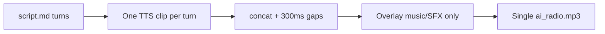
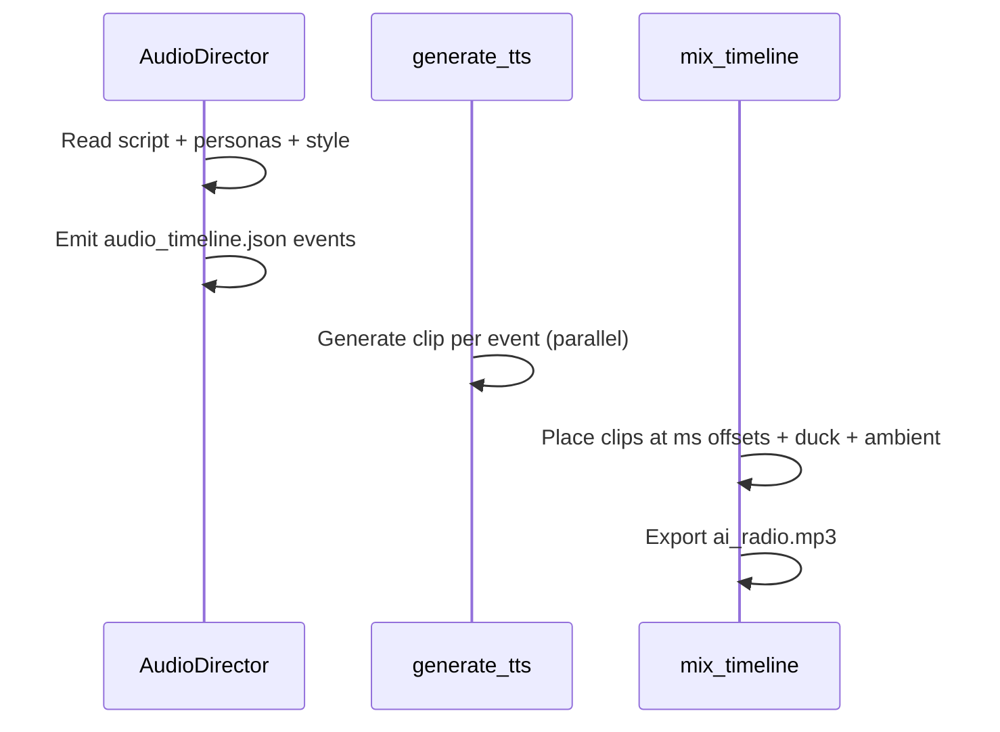

# Realistic Radio Playback Plan

## Current state (why it sounds synthetic)

The show is built as a **linear assembly line** with no speech overlap:



| Layer | Today | Realism gap |
|-------|-------|-------------|
| Script | One speaker per line; tags like `[frustratedly]` only | No crosstalk, barge-in, or reaction-under-speech |
| TTS | [`generate_tts.py`](agent/skills/tts-generation/scripts/generate_tts.py) — one Gemini call per turn, concat with fixed 300ms silence | Cannot overlap; interrupted line would need regen to "react" |
| Mix | [`mix_audio.py`](agent/skills/audio-mixing/scripts/mix_audio.py) — `overlay()` for music/SFX only; SFX timing is heuristic | No multi-voice layering; `[hold]` SFX generated but never mixed |
| Playback | [`App.tsx`](src/App.tsx) — single `<audio>` MP3 | No per-track control |
| Personas | [`showConfig.ts`](src/showConfig.ts) host/guest `persona`, `delivery`, `audioTreatment` → TTS director's notes only | Persona does not drive *when* or *how* speakers interact |

Example from [`public/shows/default/show_notes.json`](public/shows/default/show_notes.json): Elena responds to Marcus at `01:24` only after Marcus fully finishes at `01:13` — polite turn-taking, not a live debate.

---

## Design principle: "no flinch" interruptions

Real radio overlap is a **mixing problem**, not a TTS prompt problem.

**Wrong approach:** Ask Gemini TTS to generate Speaker A's line *as if* they are being interrupted — the model often stumbles, pauses unnaturally, or drops volume.

**Correct approach:**

1. Generate Speaker A's **full line** as a standalone clip (unaffected).
2. Generate Speaker B's **interjection** separately with persona-appropriate tags (e.g. `[sharply]`, `[overlapping]`).
3. Overlay B onto A at a computed offset (e.g. 75–85% through A's duration).
4. Apply gentle ducking on A during overlap (-3 to -8 dB), not a hard cut.
5. Optionally trim A's tail after B finishes if the script indicates B "takes the floor."



---

## Proposed architecture

### 1. New artifact: `audio_timeline.json`

Replace append-only concat with an explicit timeline consumed by the mixer. Stored at `workspace/data/audio_timeline.json`.

```json
{
  "events": [
    {
      "id": "turn_012_a",
      "speaker": "Guest1",
      "text": "Let me talk about a different perspective...",
      "startMs": 84200,
      "clipRef": "segments/turn_012_a.wav",
      "duckDuring": ["evt_013"]
    },
    {
      "id": "evt_013",
      "type": "interjection",
      "speaker": "Guest2",
      "text": "[sharply] Oh obviously you can't align with the rest of us",
      "startMs": 87800,
      "overlapOf": "turn_012_a",
      "overlapRatio": 0.82,
      "volumeDb": 0
    },
    {
      "id": "amb_studio",
      "type": "ambient",
      "clipRef": "sfx/studio_room_tone.wav",
      "startMs": 0,
      "loop": true,
      "volumeDb": -28
    }
  ]
}
```

**Event types to support (phased):**

| Type | Purpose | Persona drivers |
|------|---------|-----------------|
| `speech` | Normal turn | delivery, accent |
| `interjection` | Barge-in / overlap | aggressive archetypes, debate style |
| `reaction` | Low-volume "mm-hmm", "yeah", "wait" under another speaker | supportive / impatient personas |
| `backchannel` | Host acknowledgment while guest talks | measured vs energetic host |
| `pause` | Variable silence (not fixed 300ms) | late-night = longer pauses |
| `ambient` | Room tone, phone hiss, crowd murmur | `audioTreatment`, show style |
| `sfx` | connect, stinger, hold (sample-accurate) | feature flags |
| `music` | Bed with sidechain ducking | mood, segment type |

### 2. New pipeline step: Audio Direction (`direct_audio.py`)

Insert **after script review, before TTS** in [`agent/AGENTS.md`](agent/AGENTS.md):

```
script_review → direct_audio → generate_tts → mix_timeline → quality_check → metadata
```

**Inputs:** `script.md`, `show_config.json`, `script_review.json`  
**Output:** `audio_timeline.json` + optional `script_enriched.md` (human-readable annotations)

**LLM prompt logic (gemini-3.5-flash):**

- Read host/guest personas from config ([`load_config.py`](agent/skills/show-production/scripts/load_config.py) `_format_guest_archetype`)
- Apply style rules:
  - `debate` → 2–4 interjections per show, higher overlap ratio
  - `interview` → host backchannels only, no guest-on-guest overlap
  - `roundtable` → collaborative overlaps + occasional laughter SFX
  - `explainer` → minimal overlap; reaction tags only
- Topic/sensitivity heuristics:
  - When a caller uses dismissive wording ("obviously", "that's ridiculous"), flag adjacent opposing persona for interjection
  - Measured personas interrupt less; `hype` / contrarian archetypes interrupt more
- **Hard cap:** overlap density scales with `durationMinutes` (e.g. max 1 interjection per 90s for subtle mode)

**Non-LLM validation:** Python checks timeline for impossible overlaps (same speaker twice), missing clip refs, duration budget ±15%.

### 3. Script format extensions (backward compatible)

Keep existing `Speaker: text` lines in [`generate_script.py`](agent/skills/script-writing/scripts/generate_script.py) but add optional inline markers the director can also emit:

```
Guest1: [Male] [Accent: Irish] Let me talk about a different perspective...
Guest2: [interrupts Guest1] [indignantly] Oh obviously you can't align with the rest of us
```

New tags (parsed by TTS + director):

- `[interrupts SpeakerName]` — overlap event, not a sequential turn
- `[overlap +800ms]` — start this clip 800ms before previous ends (director computes exact ms)
- `[reaction]` — generate at -12 dB under current speaker
- `[pause 1.2s]` — variable gap
- `[under]` — backchannel under previous speaker

Update [`script_review.py`](agent/skills/show-production/scripts/script_review.py) to validate overlap density and persona consistency (e.g. shy archetype should not have 5 sharp interjections).

### 4. TTS changes ([`generate_tts.py`](agent/skills/tts-generation/scripts/generate_tts.py))

| Change | Detail |
|--------|--------|
| Clip-per-event | Generate WAV for each timeline event, not each script line |
| Split turns | A line with an interjection becomes 2+ clips: full base + interjector |
| Interjection prompt | Add director note: *"Deliver as a quick overlapping interjection; do not pause as if waiting for turn"* — but **never** include interrupted speaker's text in this prompt |
| Reaction prompt | Shorter text, `[quietly]` / `[murmured]` tags, same voice profile |
| Variable gaps | Remove fixed 300ms from `concatenate_wav_files`; gaps come from timeline `pause` events |
| Persona binding fix | After guided-mode script gen, map invented guest names back to roster archetypes for voice/treatment (today [`build_roster_lookups`](agent/skills/tts-generation/scripts/generate_tts.py) only matches exact `name`) |

### 5. Timeline mixer ([`mix_audio.py`](agent/skills/audio-mixing/scripts/mix_audio.py) → `mix_timeline.py`)

Replace concat-first logic with:

1. Load all speech clips; measure actual durations (pydub `len(segment)`).
2. Resolve relative offsets (`overlapRatio`, `overlapOf`) to absolute `startMs`.
3. Build master track: `AudioSegment.silent(duration=total)` then `overlay(clip, position=startMs)` for each event.
4. **Ducking:** for each `duckDuring` reference, apply gain reduction on the base clip during overlap window (simple envelope, not sidechain — sufficient for v1).
5. **Ambient beds:** loop quiet room tone under studio host segments; phone hiss under `phone` treatment guests ([`AUDIO_TREATMENTS`](src/showConfig.ts)).
6. **Music:** replace static -20 dB bed with ducking keyed off *any* speech event (sum of speech RMS → lower music).
7. **SFX:** place at exact `startMs` from timeline (fixes `[hold]` gap — wire [`generate_sfx.py`](agent/skills/show-production/scripts/generate_sfx.py) hold tone into mixer).
8. Export `ai_radio.mp3` + `timeline_manifest.json` (resolved ms for metadata).

### 6. Metadata & transcript sync ([`generate_metadata.py`](agent/skills/metadata-generation/scripts/generate_metadata.py))

- Primary: use `timeline_manifest.json` for turn-level `start`/`end` (already sample-accurate from clip placement).
- For overlapping speech: transcript shows **two active lines** during overlap (extend [`TranscriptLine`](src/types.ts) with optional `overlapGroup` or split into sub-lines).
- Optional phase 2: forced alignment (whisper/ffmpeg) for word-level karaoke — not required for v1.

### 7. Config & UI ([`showConfig.ts`](src/showConfig.ts))

Add feature flag and intensity control:

```typescript
realism: {
  enabled: boolean;           // default true for debate/call-in presets
  intensity: "subtle" | "moderate" | "lively";  // caps interjection density
  allowGuestOverlap: boolean;
  ambientBeds: boolean;       // room tone / phone hiss
}
```

Surface in Advanced panel near existing radio features (`phoneConnectSfx`, `holdMusic`, etc.). Map presets:

- `tech-debate`, `call-in-hotline` → `lively`
- `deep-interview` → `subtle`
- `roundtable-chill` → `moderate` + ambient murmur

---

## Additional realism behaviors (catalog)

Beyond the user's interruption example, prioritize by impact:

| Behavior | Mechanism | Priority |
|----------|-----------|----------|
| Guest barge-in | `interjection` overlap | P0 |
| Host "mm-hmm" while guest talks | `backchannel` at -14 dB | P0 |
| Variable pauses / thinking beats | `pause` events + `[pause]` tags | P1 |
| Phone line noise under remote guests | ambient loop per treatment | P1 |
| Studio room tone under host | ambient loop | P1 |
| Hold music between segments | fix existing `[hold]` path | P1 |
| Crowd murmur / laugh for roundtable | one-shot or loop SFX | P2 |
| 3+ simultaneous layers | mixer supports N overlays; cap at 3 for clarity | P2 |
| Music pumps under speech | sidechain ducking | P2 |
| Paper shuffle / mic bump | rare one-shot SFX on host turns | P3 |

**3+ concurrent voices:** pydub supports unlimited `overlay()` calls. Practical limit is ~3 for intelligibility. Director enforces cap; mixer ducking prevents mud.

---

## Phased rollout

### Phase 1 — Timeline foundation (highest ROI)

- Add `audio_timeline.json` schema + `direct_audio.py`
- Refactor mixer to timeline-based placement
- Fix `[hold]` mixing; sample-accurate SFX from timeline
- Variable pauses instead of fixed 300ms
- Persona → voice binding fix for guided mode

**Outcome:** Overlapping interjections work; ambient beds; accurate SFX.

### Phase 2 — Persona-driven dynamics

- Enrich script prompts with overlap-friendly dialogue in debate/roundtable styles
- Director agent uses persona traits + keyword triggers ("obviously", "wrong", "actually")
- Backchannels and reactions under speech
- `realism.intensity` config + preset mapping
- Script review checks overlap plausibility

**Outcome:** Shows feel like live call-in radio, not read-aloud.

### Phase 3 — Polish & perception

- Sidechain music ducking
- Optional crowd/laugh SFX for roundtable
- Transcript UI: highlight simultaneous speakers during overlap
- Quality check: detect clipping when >2 voices overlap, excessive overlap density
- A/B eval rubric (see below)

---

## Quality validation

Extend [`quality_check.py`](agent/skills/show-production/scripts/quality_check.py):

- Peak/RMS during overlap windows (no clipping)
- Overlap count vs `realism.intensity` budget
- Minimum 200ms intelligibility window per interjection
- Loudness still ~-16 LUFS after multi-track sum

**Human listening rubric (for tuning):**

1. Can you tell who is speaking during overlap?
2. Does the interrupted speaker sound like they continue naturally (no glitch/stutter)?
3. Would a casual listener guess "AI" within 30 seconds?

---

## Risks and constraints

| Risk | Mitigation |
|------|------------|
| Gemini TTS overlap clips sound "staged" | Keep interjections short (<4s); strong persona tags; tune `overlapRatio` per delivery style |
| Only 4 Gemini voices | Reuse voices with distinct treatment/filters; persona affects *behavior* more than timbre |
| Timeline LLM hallucinates bad offsets | Resolve offsets from measured clip durations in Python, not LLM ms guesses |
| Longer generation time | More clips but still parallel TTS (`ThreadPoolExecutor`); director step is one LLM call |
| Transcript sync during overlap | Timeline manifest is source of truth; UI shows parallel active lines |

**Out of scope for v1:** Runtime Web Audio multi-track player (large frontend rewrite; offline mix achieves the realism goal for listeners). Can revisit if live remixing is needed later.

---

## Key files to change

| File | Change |
|------|--------|
| [`agent/AGENTS.md`](agent/AGENTS.md) | Add `direct_audio` + `mix_timeline` to workflow |
| New: `agent/skills/show-production/scripts/direct_audio.py` | Persona-aware timeline generation |
| [`agent/skills/script-writing/scripts/generate_script.py`](agent/skills/script-writing/scripts/generate_script.py) | Overlap-friendly dialogue + new tags |
| [`agent/skills/show-production/scripts/script_review.py`](agent/skills/show-production/scripts/script_review.py) | Validate overlap + persona consistency |
| [`agent/skills/tts-generation/scripts/generate_tts.py`](agent/skills/tts-generation/scripts/generate_tts.py) | Event-based clips; guided name binding |
| [`agent/skills/audio-mixing/scripts/mix_audio.py`](agent/skills/audio-mixing/scripts/mix_audio.py) | Timeline mixer + ducking + ambient |
| [`agent/skills/show-production/scripts/generate_sfx.py`](agent/skills/show-production/scripts/generate_sfx.py) | Room tone, phone hiss, murmur assets |
| [`agent/skills/metadata-generation/scripts/generate_metadata.py`](agent/skills/metadata-generation/scripts/generate_metadata.py) | Timeline-based timecodes |
| [`src/showConfig.ts`](src/showConfig.ts) | `realism` config block |
| [`src/types.ts`](src/types.ts) | Optional overlap fields on transcript |
| [`src/components/Transcript.tsx`](src/components/Transcript.tsx) | Highlight concurrent speakers (Phase 3) |

---

## Example: user's scenario after implementation

**Script (debate, lively realism):**

```
Guest1: [Male] [Accent: American] Let me talk about a different perspective on this...
Guest2: [interrupts Guest1] [indignantly] Oh obviously you can't align with the rest of us on that.
Guest1: [calmly] —okay, let me finish— the perspective I'm offering is...
```

**Timeline:**

- `Guest1` full clip placed at 84.2s (continues naturally through overlap)
- `Guest2` interjection overlays at ~87.8s (82% into Guest1 clip)
- Guest1 ducked -6 dB from 87.8s–90.5s
- Optional `Guest1` continuation clip at 90.5s if script includes tail after dash

**Listener experience:** Guest2 jumps in mid-sentence; Guest1 doesn't "flinch" because their audio was generated and mixed independently.
