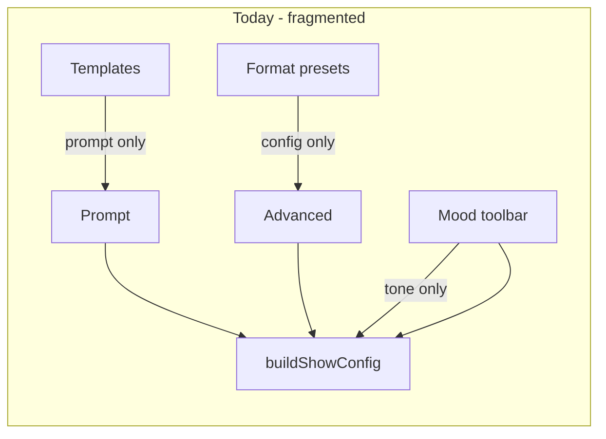
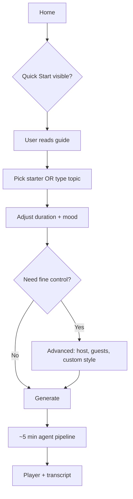

# Unified Show Starters, Advanced Sync, and Quick Start Guide

## Current problems



- **Two pickers, one job:** ["Show format presets"](c:\Users\remyg\Projects\AI Radio Show Builder\src\App.tsx) configure format/host/guests; ["Try a template"](c:\Users\remyg\Projects\AI Radio Show Builder\src\App.tsx) only fill `prompt` + `targetDuration`. Templates like "GitHub Roundtable" imply a format but never apply `roundtable-chill`.
- **Advanced looks blank:** `applyPreset` shallow-merges into `advancedOverrides`; guided presets set `guests.mode` + `count` but never `guests.roster`, so archetype cards render empty shells. Templates never touch `advancedOverrides`. Mood changes never write `structure.style`, so Show style shows "From mood / preset" even though behavior already uses `MOOD_MAPPING[targetMood].suggestedStyle` via `effectiveShowStyle`.
- **No onboarding:** Home view jumps straight to the form; `HelpCircle` is imported but unused.

---

## 1. Merge presets + templates into "Show starters"

### User mental model (make the merge feel obvious)

Replace the two separate panels with **one section** placed below the generate form:

**"Start from an example"** — subtitle: *Pick a topic and format together, or choose a format for your own topic.*

| What the user sees | What it does |
|---|---|
| Category pills: **All · Tech · Arts & Life · News · Formats** | Filters one unified list |
| Card with title + description + badges (`Roundtable`, `3 min`, `Guided guests`) | One click applies everything |
| Highlighted card = active selection | Same visual language as today's preset highlight |

**Two starter kinds** (single data model, not two UI sections):

- **`example`** — topic + format bundled (today's templates, upgraded with `presetId`, optional `mood`, `duration`)
- **`format`** — format-only (today's presets; no prompt change)

Example mappings to wire in [`showConfig.ts`](c:\Users\remyg\Projects\AI Radio Show Builder\src\showConfig.ts):

| Template | Linked preset |
|---|---|
| GitHub Roundtable | `roundtable-chill` |
| Sports Tournament Debate | `tech-debate` |
| Philosophy Café | `roundtable-chill` |
| Daily Hacker Bites | `explainer-hour` |
| Cinematic Reviews | `deep-interview` |
| Fintech Briefing | `explainer-hour` |

### Data model (new, centralized)

Add to [`showConfig.ts`](c:\Users\remyg\Projects\AI Radio Show Builder\src\showConfig.ts):

```typescript
export interface ShowStarter {
  id: string;
  kind: 'example' | 'format';
  category: 'tech' | 'culture' | 'news' | 'format';
  title: string;
  description: string;
  presetId: string;           // references SHOW_PRESETS
  prompt?: string;              // example kind only
  durationMinutes?: 3 | 5 | 10 | 15;
  mood?: UiMood;
}
```

- Derive `SHOW_STARTERS` from existing `SHOW_PRESETS` (format entries) + migrated template data (example entries).
- Remove inline `templates` / `templateCategories` from [`App.tsx`](c:\Users\remyg\Projects\AI Radio Show Builder\src\App.tsx) (~1705–1754, ~2118–2201).

### Single apply function

Replace `applyPreset` with `applyShowStarter(starterId)` in [`App.tsx`](c:\Users\remyg\Projects\AI Radio Show Builder\src\App.tsx):

1. Resolve starter → preset partial from `SHOW_PRESETS`
2. **Deep-merge** preset partial into `advancedOverrides` (reuse `deepMergeShowConfig` logic, not shallow spread)
3. Run `syncGuestRosterForMode(guests, style)` and attach **default archetype personas** (new helper — see §2)
4. Set `selectedStarterId`, `selectedPresetId`, `prompt` (if example), `targetDuration`, `targetMood` (preset mood or starter mood)
5. Reset `showStyleManuallySet` to `false` so mood/preset can drive Show style again
6. Persist via `saveAdvancedSettings`

Track `selectedStarterId` for card highlight (templates currently have no selection state).

---

## 2. Fix Advanced panel population (Host + Guest archetypes)

### Root cause

[`applyPreset`](c:\Users\remyg\Projects\AI Radio Show Builder\src\App.tsx) (lines 1068–1078) shallow-merges and never seeds `guests.roster`. [`GuestRosterEditor`](c:\Users\remyg\Projects\AI Radio Show Builder\src\components\GuestRosterEditor.tsx) computes empty slots via `syncGuestRosterForMode` but parent state lacks persona defaults.

### Fix

Add `buildDefaultGuestRoster(presetId, style, count): GuestProfile[]` in [`showConfig.ts`](c:\Users\remyg\Projects\AI Radio Show Builder\src\showConfig.ts):

- Per-preset archetype personas for guided/fixed modes (e.g. Deep Interview → 1 expert guest; Call-In Hotline → 4 caller archetypes with distinct personas/delivery/audio treatment)
- Style-based fallbacks for auto mode (no roster UI, but count/mode still written)

Extend preset partials where useful — e.g. add `guests.roster` to `deep-interview` and `call-in-hotline` in `SHOW_PRESETS`.

After merge in `applyShowStarter`, always call:

```typescript
const style = merged.structure?.style ?? MOOD_MAPPING[mood].suggestedStyle;
const guests = syncGuestRosterForMode(
  { ...merged.guests, roster: merged.guests?.roster ?? buildDefaultGuestRoster(...) },
  style
);
```

### Advanced UI: show resolved values

Bind Advanced host/guest fields to **effective config** for display, while edits still write to `advancedOverrides`:

- Compute `previewConfig = buildShowConfig({ topic: prompt || 'preview', durationMinutes, mood: targetMood, presetId: selectedPresetId, overrides: advancedOverrides })` (memoized)
- Host inputs: `value={advancedOverrides.host?.name ?? previewConfig.host.name}` pattern, or hydrate overrides on starter apply so fields are literally populated (preferred — simpler, matches E2E expectations)

**User can still customize anything** after apply; edits go through existing `updateAdvanced`.

---

## 3. Mood toolbar → Show style sync + custom override

User confirmed: **keep Mood in toolbar; auto-sync implied format into Advanced Show style.**

### Sync behavior

Add state: `showStyleManuallySet: boolean` (default `false`).

| Event | Show style in Advanced |
|---|---|
| Mood changed, `showStyleManuallySet === false` | Write `MOOD_MAPPING[mood].suggestedStyle` into `advancedOverrides.structure.style` |
| Starter/preset applied | Write preset's `structure.style`; set `showStyleManuallySet = false` |
| User changes Show style in Advanced | Set `showStyleManuallySet = true` |
| User picks "From mood / preset" (empty option) | Clear manual style + notes; set `showStyleManuallySet = false`; re-sync from mood/preset |

Rename empty option label from "From mood / preset" → **"Auto (from mood / starter)"** for clarity.

### Custom show style in Advanced

Extend schema in [`showConfig.ts`](c:\Users\remyg\Projects\AI Radio Show Builder\src\showConfig.ts):

```typescript
structure: {
  style: z.enum([...SHOW_STYLES, 'custom']).default('debate'),
  styleNotes: z.string().max(200).optional(),  // required when style === 'custom'
}
```

Advanced UI ([`App.tsx`](c:\Users\remyg\Projects\AI Radio Show Builder\src\App.tsx) ~2047–2060):

- Add `<option value="custom">Custom…</option>`
- When `custom`, show text input bound to `structure.styleNotes`
- Validation in `showConfigSchema.superRefine`: if `style === 'custom'`, require non-empty `styleNotes`

**Precedence at generation** (already mostly correct via `sanitizeOverrides` + deep merge):

1. Explicit Advanced Show style (including `custom` + notes) — highest
2. Starter/preset `structure.style`
3. Mood `suggestedStyle` — fallback

Update [`server/lib/showConfigPrompt.ts`](c:\Users\remyg\Projects\AI Radio Show Builder\server\lib\showConfigPrompt.ts):

```typescript
- Show style: ${config.structure.style === 'custom' ? config.structure.styleNotes : config.structure.style}
```

For guest limits when `custom`, fall back to `roundtable` limits in `getGuestLimits` / `effectiveShowStyle` helper.

---

## 4. Quick Start guide on landing page

New component: [`src/components/QuickStartGuide.tsx`](c:\Users\remyg\Projects\AI Radio Show Builder\src\components\QuickStartGuide.tsx)

**Placement:** between hero and generate form in home view ([`App.tsx`](c:\Users\remyg\Projects\AI Radio Show Builder\src\App.tsx) ~1838).

**Content (plain English, 4 steps):**

1. **Preview first** — open a show in Radio Show Library to hear what you'll get (~5 min generation, AI voices, synced transcript).
2. **Describe your show** — type a topic or pick a starter below; starters fill topic + format together.
3. **Tune the vibe** — Duration and Mood set length and tone; open **Advanced** to customize host persona, guest archetypes, show style, and radio features.
4. **Generate & listen** — hit Generate; agents research, script, voice, and mix. Host/Guest profile fields shape who speaks and how; they don't change your topic.

**Behavior:**

- Collapsible card (expanded by default on first visit)
- Dismiss → `localStorage.setItem('ai-radio-quickstart-dismissed', '1')`
- Small "How it works" link in hero reopens guide (wire existing unused `HelpCircle` import)

Match existing glass-card styling (`bg-[#0e0e0e]/50`, uppercase section labels, `motion` expand/collapse).

---

## 5. File changes summary

| File | Changes |
|---|---|
| [`src/showConfig.ts`](c:\Users\remyg\Projects\AI Radio Show Builder\src\showConfig.ts) | `ShowStarter`, `SHOW_STARTERS`, default guest rosters, `custom` style + `styleNotes`, export `applyStarterToOverrides()` helper |
| [`src/App.tsx`](c:\Users\remyg\Projects\AI Radio Show Builder\src\App.tsx) | Replace dual panels with `ShowStartersPanel`; mood sync effect; custom style UI; `showStyleManuallySet`; integrate QuickStartGuide |
| [`src/components/ShowStartersPanel.tsx`](c:\Users\remyg\Projects\AI Radio Show Builder\src\components\ShowStartersPanel.tsx) | **New** — category filter + starter grid (extracted from App.tsx) |
| [`src/components/QuickStartGuide.tsx`](c:\Users\remyg\Projects\AI Radio Show Builder\src\components\QuickStartGuide.tsx) | **New** — dismissible guide |
| [`server/lib/showConfigPrompt.ts`](c:\Users\remyg\Projects\AI Radio Show Builder\server\lib\showConfigPrompt.ts) | Render custom style notes |
| [`e2e/show-generator.spec.ts`](c:\Users\remyg\Projects\AI Radio Show Builder\e2e\show-generator.spec.ts) | Update preset test → starter test; add template/starter populates host+guest; mood sync; quick start visibility/dismiss |

---

## 6. Target UX flow (after)



---

## 7. Edge cases to handle

- **Stale localStorage advanced settings:** On starter apply, deep-merge should overwrite nested host/guest/structure from preset (not leave orphaned keys from prior session).
- **User edits prompt after starter:** Keep format config; only clear starter highlight if prompt diverges significantly (optional: compare to starter prompt, or keep highlight until another starter is picked — simpler).
- **Custom show style validation:** Block generate with inline `configError` if custom selected but notes empty.
- **Auto guest mode:** No archetype cards shown, but host fields and show style must still populate from starter.
- **All templates currently hardcode 3 min:** Preserve that default in `SHOW_STARTERS`; user can still change duration after apply.
